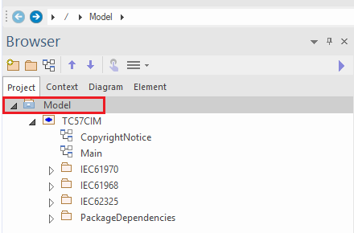
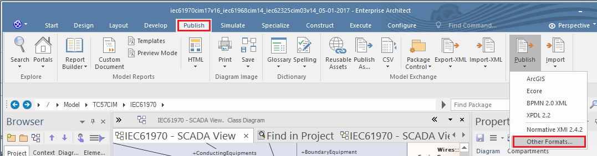
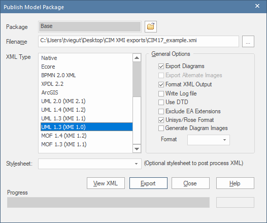
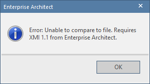
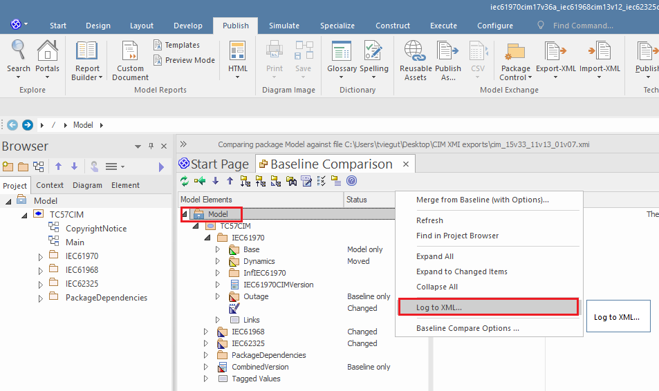

Procedures for Model Comparisons in Enterprise Architect
--------------------------------------------------------

EA can be used to perform a comparison between two models and the result
exported as an XML “model comparison log. In turn, the log can be passed as
input to **cim-compare** to generate the final HTML report.

The term “target” is used to describe some current (or later) version of the CIM
that is to be the target of the comparison. The term “baseline” is used to
describe the **historical** model against which the “target” model is to be
compared to determine what has changed. The comparison is accomplished using
EA’s Compare Utility (see:
<https://sparxsystems.com/enterprise_architect_user_guide/15.1/model_repository/differences.html>).

The procedure to execute a comparison is done in the following manner
(screenshots are from EA v15.1):

-   First, from within EA load the “baseline” (or older) model and select the
    top-level package of the CIM.

-   Once selected, select the Publish menu as shown in the screenshot and select
    “Other Formats…”

-   Export the CIM package as an **XMI 1.1** compliant file of the older model
    with which to perform the comparison against. The only requirement in the
    “Publish Model Package” dialog is that the “UML 1.2 (XMI 1.1)” format be
    selected as the export format. In the screenshot below of the export dialog
    it should be noted that the “Export Diagrams” and “Unisys/Rose Format” may
    or may not be selected as part of the **XMI 1.1** export. They play no role
    as part of the processing done by the command line utility.

*Important*: EA only supports comparisons against **XMI 1.1** files. If
attempting to compare a model against an XMI file that is not in the XMI 1.1
format the following error will be presented:

-   Second, the newer CIM model with which to perform the comparison on should
    be opened in EA. This is typically done by simply opening the EA project
    file. For the purposes of the Compare Utility, this is the “target” model
    which EA will perform diff against the **XMI 1.1** file of the older
    “baseline” CIM model.

-   Once the “target” model has been loaded in EA you should ensure that the
    following settings in the “Baseline Compare Options” dialog are set before
    running the Compare Utility:

To display this dialog, either:

-   Click on the Options button on the 'Package Baselines' dialog, or

-   Click on the 'Compare Options' icon in the 'Compare Utility' view toolbar

-   The final step is to select the “baseline” **XMI 1.1** file that was
    exported in the prior steps and which you want to compare the “target” model
    against.

>   Then choose the file…

>   Once selected the comparison will begin. The comparison process is known to
>   take a number of minutes to complete given the size of the CIM models.

-   When the comparison is completed select the root Model package and right
    mouse click and select the “Log to XML…” menu item. This will save the
    “model comparison log” XML file to the file system which can then be used as
    input into the utility.

