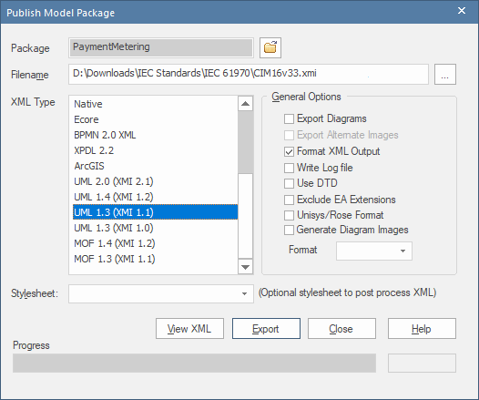
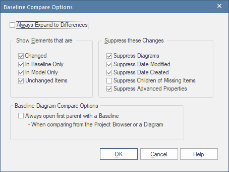

Procedures for Creating Model Comparisons XML Logs in Enterprise Architect
--------------------------------------------------------

EA can be used to perform a comparison between two models and the result
exported as an "XML Comparison Log". In turn, the log can be passed as
input to **cim-compare** to generate a final HTML comparison report.

The term “target” is used to describe some current (or later) version of the CIM
that is to be the target of the comparison. The term “baseline” is used to
describe the **historical** model against which the “target” model is to be
compared to determine what has changed. The comparison is accomplished using
EA’s Compare Utility.

(see:
<https://sparxsystems.com/enterprise_architect_user_guide/15.1/model_repository/differences.html>).

The procedure to execute a comparison is done in the following manner
(screenshots taken from EA v15.1):

1.  From within EA load the “baseline” (or older) model and select the top-level package of the CIM.

   

      
   

2.  Once selected, select the Publish menu as shown in the screenshot and select “Other Formats…”

   

      
   

3. Export the CIM package as an **XMI 1.1** compliant file of the older baseline model with which to perform a comparison against. In the “Publish Model Package” dialog the **“UML 1.3 (XMI 1.1)”** XML Type must be selected as the export format and the "Unisys/Rose Format" option must not be checked. Note that when generating an XML Compare Log in EA that UML diagram comparisons are not supported natively. So the "Export Diagrams" and "Generate Diagram Images" options should be left unchecked.

   

      
   

---
_**IMPORTANT:**_

*EA only supports comparisons against **XMI 1.1** files. If attempting to compare a model against an XMI file that is not in the **XMI 1.1** format the following error will be presented:*

  

---

4. The newer CIM model with which to perform the comparison on should be opened in EA. For the purposes of the Compare Utility, this is the “target” model which EA will perform diff against the **XMI 1.1** file of the older “baseline” CIM model.

5. Once the “target” model has been loaded in EA you should ensure that the following settings in the “Baseline Compare Options” dialog are set before running the Compare Utility.

   To display this dialog, either:
   - Click on the **Options** button on the **'Package Baselines'** dialog, or
   - Click on the **'Compare Options'** icon in the **'Compare Utility'** view toolbar

      

        
      

6. The final step is to select the “baseline” **XMI 1.1** file that was exported in the prior steps and which you want to compare the “target” model against.

   

     
   

-   Then choose the file.  Once selected the comparison will begin. The comparison process is known to take a number of minutes to complete given the size of the CIM models.

   

     
   

7.   When the comparison is completed select the root Model package and right mouse click and select the **“Log to XML…”** menu item. This will save the model comparison log XML file to the file system which can then be used as input into **cim-compare** as described in command line Option \#2 in the project README file.

   

     
   

