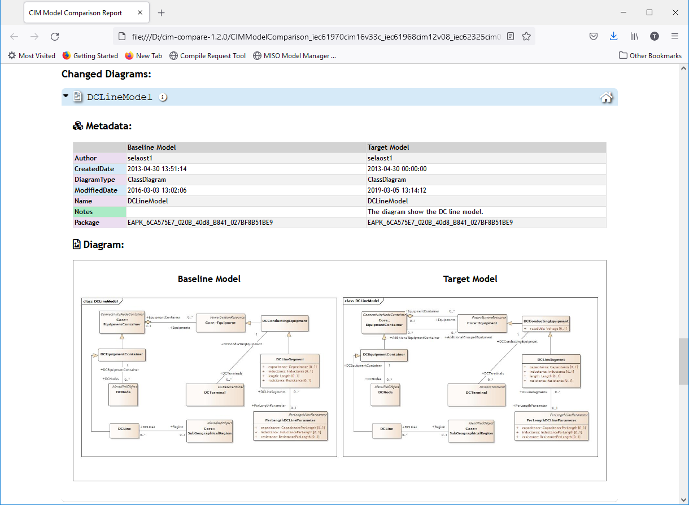
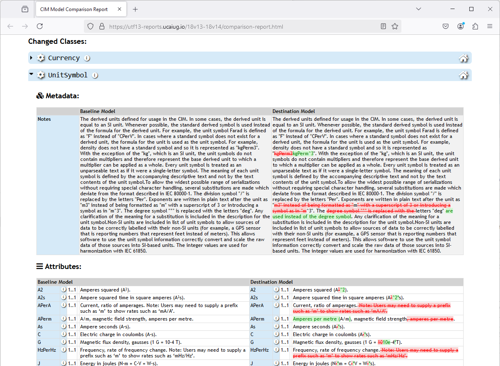
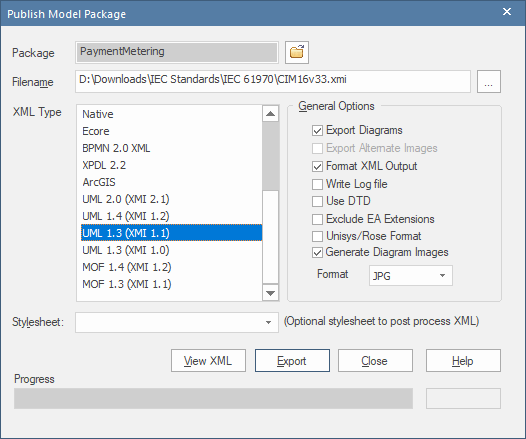

# cim-compare

  
\[[GitHub Repo](https://github.com/cimug-org/cim-compare)\]
      
The **cim-compare** project is a command line tool for generating CIM model comparison reports. For an example report visit [comparison-report.html](https://cim-compare.ucaiug.io/example-comparison-report/comparison-report.html).

## Table of Contents
- [Home](#cim-compare)
- [Latest Release](#latest-release)
- [Overview: CIM Model Comparison Reports](#overview-cim-model-comparison-reports)
- [Setup & Configuration](#setup--configuration)
  - [Java Technical Requirements](#java-technical-requirements)
  - [Important Setup Considerations](#important-setup-considerations)
  - [Warning: Potential Configuration Pitfalls](#warning-potential-configuration-pitfalls)
- [Command Line Usage](#command-line-usage)
  - [Option #1: Enterprise Architect .EAP or .QEA Project Files as Input](#option-1-enterprise-architect-eap-or-qea-project-files-as-input)
  - [Option #2: XMI Baseline and Destination Models as Inputs](#option-2-xmi-baseline-and-destination-models-as-inputs)
  - [Option #3: EA Model Comparison Logs as Input](#option-3-ea-model-comparison-logs-as-input)
- [Enterprise Architect XMI Export Procedures](#enterprise-architect-xmi-export-procedures)
- [License](#license)


## Latest Release

1.3.0  

 - For release notes describing the latest features and/or fixes visit [latest release](https://github.com/cimug-org/cim-compare/releases).
 - To directly download the latest release of the cim-compare command-line application click [cim-compare-1.3.0.jar](https://github.com/cimug-org/cim-compare/releases/download/1.3.0/cim-compare-1.3.0.jar).


## Overview: CIM Model Comparison Reports

**cim-compare** generates model comparison reports between two points in time. A link to the latest release can be found at the end of this README.

The term “destination” is used to describe some current version (or latest working copy) of a CIM model that is to be the target of the comparison. The term “baseline” is used to describe the **historical** model against which the “destination” model is to be compared to determine what has changed.

Enterprise Architect (Corporate Edition and above) has the capability to perform these model comparisons; however, the feature is not generally useful as results are only exportable as XML files that are not easily human readable.

The output generated by **cim-compare** results in a self-contained HTML comparison report of all changes between a “baseline” and “destination” model. The report is viewable in most standard browsers such as Firefox, Chrome, Edge, IE, etc. and provides the ability to search for specific CIM classes within the report.

Reports use colors to visually indicate changes to packages, classes, attributes, generalizations, and associations. New items are shown in green, deleted items in red, items that have moved location within the model appear as yellow, blue represents items that were changed in some way, and violet indicates items that are unchanged.


As illustrated next, UML diagrams that have been added, removed or modified can also be included in comparison reports. To include diagrams refer to the command line procedures described further down.



For ease of identification, changes to class and attribute descriptions are visualized as shown.



## Setup & Configuration

### Java Technical Requirements

**cim-compare** ships as a fully self-contained executable jar file with no external dependencies.

Given the large file sizes consumed and produced by the utility, **OutOfMemory** exceptions occur if the default heap (memory) size is used. The following guidelines should be followed:

> For a 32-bit JRE it is recommended to specify a max heap size of at least 1G (i.e. 1024m) resources permitting. With a 1G heap size the execution will typically run slower. Note that the maximum theoretical heap limit for a 32-bit JVM is 4G. However, due to various additional constraints such as available swap, kernel address space usage, memory fragmentation, and VM overhead, in practice the limit can be much lower. On most modern 32-bit Windows systems the maximum heap size will range from 1.4G to 1.6G.

java <span style="color:red">-mx1G</span> -jar **cim-compare-1.3.0.jar** iec61970cim16v26a.xmi iec61970cim17v16.xmi D:\\reports

> For 64 bit JREs it is recommended that the maximum heap size be increased to at least 2G (i.e. 2048m) but more if available. It has been observed that 2G is minimally sufficient to handle larger CIM models one might encounter. In the below example 4G is being allocated.

java <span style="color:red">-mx4G</span> -jar **cim-compare-1.3.0.jar** iec61970cim16v26a.qea iec61970cim17v16.qea D:\\reports

### Important Setup Considerations

> The **cim-compare** commoand line option described in the [Option #1: Enterprise Architect .EAP or .QEA Project Files as Input](#option-1-enterprise-architect-eap-or-qea-project-files-as-input) section requires EA's COM automation API. Consequently, if you plan to use it you are required to have a licensed version of Sparx Enterprise Architect (EA) installed for the COM automation API to work. The EA API and the `eaapi.jar` file act as interfaces to the Enterprise Architect application. The following explains why:
> 
> - Dependency on the Sparx Enterprise Architect Application:
>    - The EA COM API and `eaapi.jar` rely on the backend functionality of the Enterprise Architect software. They act as a bridge to interact with the models, diagrams, and repositories managed by EA.
>    - Without the Enterprise Architect application installed, there is no core functionality or data source for the API to connect to.
> - Enterprise Architect COM Object:
>    - The `SSJavaCOM.dll` and `SSJavaCOM64.dll` are COM interface wrappers that requires Enterprise Architect's COM objects to function. These COM objects are installed as part of the Enterprise Architect installation process.
> - Licensing Requirements:
>    - Sparx Enterprise Architect is a licensed product, and the API requires a valid license to access its features. Without a licensed installation of Enterprise Architect, the API calls will fail or be severely limited.
> - Runtime Dependency:
>    - When using the COM automation interface, **cim-compare** initializes and communicates with an EA process. The underlying API calls interact with the installed Enterprise Architect software to perform operations like exporting `.xmi` files from an `.eap` or `.qea` file.
>   
> The COM interface wrappers ship with each  of Sparx EA and are delivered in an installation directory similar to:
>
> `%WINDOWS_PROGRAM_FILES%\Sparx Systems\EAxx\Java API  (e.g. "C:\Program Files\Sparx Systems\EA16\Java API")`
>
> The purpose of each is:
> 
> - SSJavaCOM.dll - the 32-bit COM Module DLL (Dynamic Linked Library) that **cim-compare** will link to when a 32-bit Java JVM/JRE is used to run `cim-compare-1.3.0.jar` from the command line (i.e. required when processing 32-bit .EAP project files).
>
> - SSJavaCOM64.dll - the 64-bit COM Module DLL that **cim-compare** will link to when a 64-bit Java JVM/JRE is used to run `cim-compare.jar` from the command line (i.e. required when processing 64-bit .QEA project files)
>   	
> **cim-compare** communicates to the appropriate COM Module DLL depending on the particular JVM (32-bit or 64-bit) being used on the command line. Which DLL COM interface wrapper to load and link to is determined at runtime. 
>
> Another key requirement is that these two DLL COM interface wrappers must be available to Java at runtime. This is done on the command line by specifying their directory location using the `-Djava.library.path` JVM parameter.
> 

To use **cim-compare** on a system with a dual 32-bit and 64-bit Sparx EA installation (e.g. EA 15.x and EA 16.x) you will need to have a configuration similar to the following:

```
C:\cim-compare\cim-compare-1.3.0.jar  
C:\cim-compare\ea15\SSJavaCOM.dll
C:\cim-compare\ea15\SSJavaCOM16.dll
C:\cim-compare\ea16\SSJavaCOM.dll
C:\cim-compare\ea16\SSJavaCOM16.dll

C:\
├── cim-compare
│   ├── cim-compare-1.3.0.jar   (the latest downloaded from https://cim-compare.ucaiug.io)
│   ├── cim-compare-1.3.0.bat   (example batch file for execution)
│   ├── ea15
│   │   ├── SSJavaCOM.dll       (copied from "C:\Program Files (x86)\Sparx Systems\EA15\Java API")
│   │   └── SSJavaCOM16.dll     (copied from "C:\Program Files (x86)\Sparx Systems\EA15\Java API")
│   ├── ea16
│   │   ├── SSJavaCOM.dll       (copied from "C:\Program Files\Sparx Systems\EA16\Java API")
│   │   └── SSJavaCOM16.dll     (copied from "C:\Program Files\Sparx Systems\EA16\Java API")
│   ├── cim17v40.eap
│   ├── cim18v02.eap
│   ├── cim18v12.qea
│   └── cim18v13.qea
├── Program Files (x86)         (32-bit JVM installation required for processing 32-bit .eap files)
│   └── Zulu
│       └── zulu-17
│           └── bin
│               └── java.exe
├── Program Files               (64-bit JVM installation required for processing 64-bit .qea files)
│   └── Zulu
│       └── zulu-17
│           └── bin
│               └── java.exe
└── ...
```
Of importance is that each EA installation's set of DLL files be located in their own directory. This will allow for the ability to isolate where Java looks for its COM Modules based on the specific release of Sparx EA. 

Following is a set of command lines based on the above example configuration and file system structure. The first illustrates comparison report generation for 32-bit `.eap` files and the second for 64-bit `.qea` files. 
 
```
"C:\Program Files (x86)\Zulu\zulu-17\bin\java.exe" -mx1G -Djava.library.path="D:\cim-compare\ea15" \
-jar cim-compare-1.3.0.jar cim17v40.eap cim18v02.eap comparison-report.html \
--include-diagrams --image-type=JPG --minimal
```

The above 32-bit command line example uses:
 - a 32-bit Java 17 JRE/JVM  (i.e. "C:\Program Files (x86)\Zulu\zulu-17\bin\java.exe")
 - a max heap size of 1G (i.e. 1024m)  (i.e. 1GB specified via `-mx1G` or `-mx1024m`)
 - the 32-bit COM DLL loaded from the "D:\cim-compare\ea15" directory  (i.e. via `-Djava.library.path="D:\cim-compare\ea15"`) 
 - cim17v40.eap as the input baseline model  (i.e. a 32-bit EA project file indicated by the `.eap` extension)
 - cim18v02.eap as the input destination model  (i.e. a 32-bit EA project file indicated by the `.eap` extension)
 - comparison-report.html as the name of the generated report
 - the inclusion of changed diagrams in the report (i.e. `--include-diagrams`)
 - JPG for the type of diagrams (i.e. `--image-type=JPG`)
 - the inclusion of only changed elements (i.e. `--minimal`)

```
"C:\Program Files\Zulu\zulu-17\bin\java.exe" -mx4G -Djava.library.path="D:\cim-compare\ea16" \
-jar cim-compare-1.3.0.jar cim17v40.qea cim18v02.qea comparison-report.html \
--include-diagrams --image-type=JPG --minimal
```
The above 64-bit command line example uses:
 - a 64-bit Java 17 JRE/JVM  (i.e. "C:\Program Files\Zulu\zulu-17\bin\java.exe")
 - a max heap size of 4G (i.e. 4096m) (i.e. 4GB specified via `-mx4G` or `-mx4096m`)
 - the 64-bit COM DLL loaded from the "D:\cim-compare\ea16" directory  (i.e. via `-Djava.library.path="D:\cim-compare\ea16"`) 
 - cim17v40.qea as the input baseline model  (i.e. a 64-bit EA project file indicated by the `.qea` extension)
 - cim18v02.qea as the input destination model  (i.e. a 64-bit EA project file indicated by the `.qea` extension)
 - comparison-report.html as the name of the generated report
 - the inclusion of changed diagrams in the report (i.e. `--include-diagrams`)
 - JPG for the type of diagrams (i.e. `--image-type=JPG`)
 - the inclusion of only changed elements (i.e. `--minimal`)
 
### Warning: Potential Configuration Pitfalls

> A common "gotcha" that users run into is that when using `.eap` project files as input into **cim-compare**, they unknowingly use 64-bit Java instead of 32-bit Java (and vice versa). It is a hard requirement that when using `.qea` files 64-bit Java **must** be used and, conversely, when using `.qea` files 64-bit Java **must** be used. 
>
> Noteworthy in the previous command line examples is that `java` has been expressly qualified as either `"C:\Program Files (x86)\Zulu\zulu-17\bin\java.exe"` or `"C:\Program Files\Zulu\zulu-17\bin\java.exe"` to ensure that the correct version of Java is used. This is not a requirement but rather one method to eliminate this as a pitfall.
>
> If choosing to simplify the command line via use of the default installation of Java such as:
>
> `java -mx4G -Djava.library.path="D:\cim-compare\ea16" -jar cim-compare-1.3.0.jar ...`
> 
> ...then it is suggested that you confirm the bit-wise version of your default Java installation. The following java command will result in output that should indicate if your default installation is 32-bit. This either by explicitly stating as such or by including the installation directory which for 32-bit will be located in `C:\Program Files (x86)\...`. Note that for many of the newest releases of Java, if not explicitly stated as being 32-bit, it is then implied to be 64-bit as illustrated in this example:
>
> ```
> C:\>java -version
> openjdk version "17.0.13" 2024-10-15 LTS
> OpenJDK Runtime Environment Zulu17.54+21-CA (build 17.0.13+11-LTS)
> OpenJDK Client VM Zulu17.54+21-CA (build 17.0.13+11-LTS, mixed mode, emulated-client)
> ```
> 
> If command line execution results in an error similar to the following then it typically is an indicator that the Java executable being used does not bit-wise match the project files being input:
>
> ```
> java.lang.Exception: Internal application error.
>        at org.sparx.Repository.comGetModels(Native Method)
>        at org.sparx.Repository.GetModels(Repository.java:805)
>        at org.cimug.compare.app.CIMModelComparisonGenerator.parseFileArguments(CIMModelComparisonGenerator.java:492)
>        at org.cimug.compare.app.CIMModelComparisonGenerator.main(CIMModelComparisonGenerator.java:107)
>ERROR:  Terminating XMI export processing for EA project file [CIMMarket04v16a.eap] due to an unexpected exception.
> ```
> 
> Finally, keep in mind that when using the default installation you could have a bit-wise compliant version of Java and have no issues creating reports which than later no longer appears functions. Such a scenario can occur when between uses of cim-compare, software is installed on your system that, as part of its installer, install a newer 64-bit version of Java making. This then could make that Java installation your new default Java. This typically happens "under the radar" and should be one of the first things checked when troubleshooting potential issues. 
>

## Command Line Usage

The **cim-compare** utility has three possible command-line options to produce comparison reports as described next.

### Option \#1: Enterprise Architect .EAP or .QEA Project Files as Input

The preferred usage is to provide two Enterprise Architect `*.eap` or `*.qea` files for the "baseline" and "destination" input files.  Using these file types eliminates the need to manually export XMI and diagrams from EA as described later in the [Enterprise Architect XMI Export Procedures](#enterprise-architect-xmi-export-procedures) section. When using these file types as inputs on the command line both "baseline" and "destination" files must be either 32-bit (i.e. `*.eap`) or 64-bit (i.e. `*.qea`) files. Note that the processing of 64-bit `*.qea` files is more performant.

The command-line usage for this option takes the following form:

```
java [<jvm-parameter-1>]...[<jvm-parameter-n>] -jar cim-compare-1.3.0.jar \
<baseline-model-file> <destination-model-file> [<output-directory-or-html-file>] \
[--package=<package-name>] [--minimal] [--include-diagrams] [--image-type=<image-file-extension>] \
[--zip] [--cleanup]
```

*Parameter Details*:

**[\<`jvm-parameter-x`\>] (Optional)**: A JVM (Java Virtual Machine) parameter that may be needed for execution. JVM parameters are configurations used to control the behavior of the JVM at runtime and take a form such as `-mx1096m`, `-mx4G` or `-Dfile.encoding=UTF-8`. These parameters can influence memory usage, garbage collection, system properties, debugging, and performance tuning. JVM parameters are passed as command-line arguments when starting a Java application and if used should **appear first** in the sequence of command line arguments (before `cim-compare-1.3.0.jar`). This is necessary so that **cim-compare** does not try to process them as part of its command line arguments which should always appear after `cim-compare-1.3.0.jar`. Note that for this Option #1 the `-Djava.library.path=<directory>` JVM parameter is required as will be described later.

**\<`baseline-model-file`\>** (**Required**): An Enterprise Architect baseline .eap or .qea model file. When not specified as an absolute file path the location is assumed to be the directory **cim-compare** is being executed from.

**\<`destination-model-file`\>** (**Required**): An Enterprise Architect destination .eap or .qea model file. When not specified as an absolute file path the location is assumed to be the directory **cim-compare** is being executed from.

**[\<`output-directory-or-html-file`\>] (Optional)**: An output directory or an output HTML file. In the case where a directory is specified but does not exist it will be created. The same is true for the parent directory of a specified HTML file if it does not exist. When an HTML file is provided it may be specified as an absolute file path or as the simple name of an HTML file to be generated. If this command line option is not specified then **cim-compare** will generate an HTML file whose name is derived from the two input files.

**[`--package=<package-name>`] (Optional):** The root package within the models from which to start the comparison report from. Appearing at the end of the command-line after file and directory specifications, when specified the package must exist in both the baseline and destination models (e.g. --package=IEC61970, --package=Grid, --package=IEC61968, --package=IEC62325, --package=CIM, etc.) and be specified with two leading dashes (--). Note that when **no** IEC package name is specified that the report is generated from the root package in the models.

**[`--minimal`] (Optional):** When specified **cim-compare** will exclude all "Identical" packages, classes, attributes, links, diagrams, etc. from the generated report. This is useful when it is necessary to perform detailed analysis of only the most concise set of changes between models.

**[`--include-diagrams`] (Optional):** Indicates that diagram images should also be exported from EA along with the XMI exports. The type of images to be exported should also be provided using the --image-type option. When not specified the image type will default to JPG.

**[`--image-type=<image-file-extension>`] (Optional):** The type of diagrams to be exported from EA (i.e. JPG, GIF, PNG, BMP, or EMF). This can be skipped for JPG images as JPG is used as the default value when the option is not specified. This command line option is only used when --include-diagrams also appears on the command line.

**[`--zip`] (Optional):** When specified **cim-compare** will package up the generated report and any associated diagrams into a single ZIP archive. It is most often utilized for packaging the report when diagram images are included and can help simplify distribution.

**[`--cleanup`] (Optional):** When specified **cim-compare** will delete all artifacts and directories created during report generation except for the ZIP archive. This command line option is only relevant when --zip also appears on the command line.

Notice that in the following command line examples where a directory or file path contains spaces it is specified within quotes.

| **Command Line Examples:**                                                                               |
|----------------------------------------------------------------------------------------------------------|
| `java -mx1096m -Djava.library.path="D:\cim-compare\ea15" -jar cim-compare-1.3.0.jar "C:\\exports\\15v33.eap" "C:\\exports\\CIM16v26a.eap" "C:\\"` |
| `java -mx4096m -Djava.library.path="D:\cim-compare\ea16" -jar cim-compare-1.3.0.jar "C:\\exports\\15v33.qea" "C:\\exports\\CIM16v26a.qea" "C:\\"` |
| `java -mx1096m -Djava.library.path="D:\cim-compare\ea15" -jar cim-compare-1.3.0.jar "C:\\exports\\15v33.eap" "C:\\exports\\CIM16v26a.eap" --package=IEC61970 --minimal` |
| `java -mx1096m -Djava.library.path="D:\cim-compare\ea15" -jar cim-compare-1.3.0.jar CIM15v33.eap CIM16v26a.eap C:\\ --minimal`  |
| `java -mx1096m -Djava.library.path="D:\cim-compare\ea15" -jar cim-compare-1.3.0.jar CIM15v33.eap CIM16v26a.eap C:\\ --minimal --include-diagrams --zip` |
| `java -mx4096m -Djava.library.path="D:\cim-compare\ea16" -jar cim-compare-1.3.0.jar CIM15v33.qea CIM16v26a.qea C:\\CIM15v33_CIM16v26a_ComparisonReport.html` |
| `java -mx1096m -Djava.library.path="D:\cim-compare\ea15" -jar cim-compare-1.3.0.jar CIM15v33.eap CIM16v26a.eap CIM15v33_CIM16v26a_ComparisonReport.html --minimal` |
| `java -mx1096m -Djava.library.path="D:\cim-compare\ea15" -jar cim-compare-1.3.0.jar CIM15v33.eap CIM16v26a.eap --package=IEC62325 --minimal --include-diagrams --image-type=GIF --zip --cleanup` |
| `java -mx4096m -Djava.library.path="D:\cim-compare\ea16" -jar cim-compare-1.3.0.jar CIM15v33.qea CIM16v26a.qea --package=Grid --minimal --include-diagrams --image-type=GIF --zip --cleanup` |

NOTE:  The above command line examples illustrate the use of both `.eap` and `.qea` EA files as input. Where `.eap` files appear as input on the command line it is assumed that 32-bit Java is being used to execute the `.jar` file. Likewise, for `.qea` files that 64-bit Java is executed.

### Option \#2: XMI Baseline and Destination Models as Inputs

The second usage is to directly specify two XMI 1.1 compliant files representing the "baseline" and “destination” models exported as described later in [Enterprise Architect XMI Export Procedures](#enterprise-architect-xmi-export-procedures). In this scenario the command-line usage takes the following form:

```
java [<jvm-parameter-1>]...[<jvm-parameter-n>] -jar cim-compare-1.3.0.jar \
<baseline-model-xmi-file> <destination-model-xmi-file> [<output-directory-or-html-file>] \
[--package=<package-name>] [--minimal] [--include-diagrams] [--image-type=<image-file-extension>] [--zip] [--cleanup]
```

*Parameter Details*:

**[`<jvm-parameter-x>`] (Optional)**: A JVM (Java Virtual Machine) parameter that may be needed for execution. JVM parameters are configurations used to control the behavior of the JVM at runtime and take a form such as `-mx1096m`, `-mx4G` or `-Dfile.encoding=UTF-8`. These parameters can influence memory usage, garbage collection, system properties, debugging, and performance tuning. JVM parameters are passed as command-line arguments when starting a Java application and if used should **appear first** in the sequence of command line arguments (before `cim-compare-1.3.0.jar`). This is necessary so that **cim-compare** does not try to process them as part of its command line arguments which should always appear after `cim-compare-1.3.0.jar`.
**`<baseline-model-xmi-file>`** (**Required**): An XMI 1.1 compliant baseline model file exported from EA. When not specified as an absolute file path the location of the file is assumed to be the directory the utility is being executed from.

**`<destination-model-xmi-file>`** (**Required**): An XMI 1.1 compliant destination model file exported from EA. When not specified as an absolute file path the location of the file is assumed to be the directory the utility is being executed from.

**[`<output-directory-or-html-file>`] (Optional)**: An output directory or an output HTML file. In the case where a directory is specified but does not exist it will be created. The same is true for the parent directory of a specified HTML file if it does not exist. When an HTML file is provided it may be specified as an absolute file path or as the simple name of an HTML file to be generated. If this command line option is not specified then **cim-compare** will generate an HTML file whose name is derived from the two input files.

**[`--package=<package-name>`] (Optional):** The root package within the models from which to start the comparison report from. Appearing at the end of the command-line after file and directory specifications, when specified the package must exist in both the baseline and destination models (e.g. --package=IEC61970, --package=Grid, --package=IEC61968, --package=IEC62325, --package=CIM, etc.) and be specified with two leading dashes (--). Note that when **no** IEC package name is specified that the report is generated from the root package in the models.

**[`--minimal`] (Optional):** When specified **cim-compare** will exclude all "identical" packages, classes, attributes, links, diagrams, etc. from the generated report. This is useful when it is necessary to perform detailed analysis of only the most concise set of changes between models.

**[`--include-diagrams`] (Optional):** When specified **cim-compare** indicates that diagram images should be included in the generated comparison report. Note that if the types of diagrams to be included are not JPG files then the --image-type option must also be used in tandem. When this option does not appear on the command line no diagrams will be included in the report.

> IMPORTANT: this command line option does not automatically export diagrams as performed in usage Option \#1.  Rather the expectation is that they be exported as part of manual exports of XMI baseline and destination models from EA and that images are hosted in folders named &lt;output directory&gt;/Image-baseline and &lt;output directory&gt;/Image-destination respectively. This must be done prior to running **cim-compare**. Refer to the "Enterprise Architect XMI Export Procedures" in this README for further details.

**[`--image-type=<image-file-extension>`] (Optional / Conditionally Required):** Indicates the type of images (i.e. JPG, GIF, PNG, BMP, or EMF) referenced in the report. Conditionally required when the --include-diagrams option is used and the diagram are not JPG image files. When not specified the default image type of JPG is used. This command line option is only relevant when --include-diagrams also appears on the command line.

**[`--zip`] (Optional):** When specified **cim-compare** will package up the generated report and any associated diagrams into a single ZIP archive. It is most often utilized for packaging the report when diagram images are included and can help simplify distribution.

**[`--cleanup`] (Optional):** When specified **cim-compare** will delete all artifacts and directories created during report generation except for the ZIP archive. This command line option is only relevant when --zip also appears on the command line.

Note that in the following command line examples whenever a directory or file path contains spaces it is specified within quotes.

| **Command Line Examples:**                                                                               |
|----------------------------------------------------------------------------------------------------------|
| `java -mx2048m -jar cim-compare-1.3.0.jar "C:\\XMI exports\\15v33.xmi" "C:\\XMI exports\\CIM16v26a.xmi" "C:\\"` |
| `java -mx2048m -jar cim-compare-1.3.0.jar "C:\\XMI exports\\15v33.xmi" "C:\\XMI exports\\CIM16v26a.xmi" --package=IEC61970 --minimal` |
| `java -mx2048m -jar cim-compare-1.3.0.jar CIM15v33.xmi CIM16v26a.xmi C:\\ --minimal`  |
| `java -mx2048m -jar cim-compare-1.3.0.jar CIM15v33.xmi CIM16v26a.xmi C:\\ --minimal --include-diagrams --image-type=gif --zip --cleanup` |
| `java -mx2048m -jar cim-compare-1.3.0.jar CIM15v33.xmi CIM16v26a.xmi C:\\CIM15v33_CIM16v26a_ComparisonReport.html` |
| `java -mx2048m -jar cim-compare-1.3.0.jar CIM15v33.xmi CIM16v26a.xmi CIM15v33_CIM16v26a_ComparisonReport.html --minimal` |
| `java -mx2048m -jar cim-compare-1.3.0.jar CIM15v33.xmi CIM16v26a.xmi CIM15v33_CIM16v26a_ComparisonReport.html --package=IEC62325 --include-diagrams --image-type=JPG --zip` |

### Option \#3: EA Model Comparison Logs as Input

The third option is by specifying an **EA model comparison log** file as input on the command line. In order to perform this option it is first required that a comparison XML log file be generated from within Enterprise Architect.  Refer to the [EA Comparison Log Procedures](EA_COMPARE_PROCEDURES.md) for detailed information on generating XML Compare Logs from within Enterprise Architect. It is important to note that EA does not support comparisons of UML diagrams and therefore diagrams are not supported as part of reports generated using Option \#3.

This particular usage takes the following form:

```
java [<jvm-parameter-1>]...[<jvm-parameter-n>] -jar cim-compare-1.3.0.jar \
<comparison-results-xml-file> [<output-directory-or-html-file>] [--package=<package-name>] [--minimal] \
[--zip] [--cleanup]
```

*Parameter Details*:

**[`<jvm-parameter-x>`] (Optional)**: A JVM (Java Virtual Machine) parameter that may be needed for execution. JVM parameters are configurations used to control the behavior of the JVM at runtime and take a form such as `-mx1096m`, `-mx4G` or `-Dfile.encoding=UTF-8`. These parameters can influence memory usage, garbage collection, system properties, debugging, and performance tuning. JVM parameters are passed as command-line arguments when starting a Java application and if used should **appear first** in the sequence of command line arguments (before `cim-compare-1.3.0.jar`). This is necessary so that **cim-compare** does not try to process them as part of its command line arguments which should always appear after `cim-compare-1.3.0.jar`.

**`<comparison-results-xml-file>` (Required):** The model comparison file. When not specified as an absolute file path the location of the file is assumed to be the directory the utility is being executed in.

**[`<output-directory-or-html-file>`] (Optional)**: An output directory or an output HTML file. In the case where a directory is specified but does not exist it will be created. The same is true for the parent directory of a specified HTML file if it does not exist. When an HTML file is provided it may be specified as an absolute file path or as the simple name of an HTML file to be generated. If this command line option is not specified then **cim-compare** will generate an HTML file whose name is derived from the two input files.

**[`--package=<package-name>`] (Optional):** The root package to compare and generate the comparison report on. Appearing at the end of the command-line after file and directory specifications, the package must exist in both the baseline and destination models (e.g. --package=IEC61970, --package=Grid, --package=IEC61968, --package=IEC62325, --package=CIM, etc.) and be specified with two leading dashes (--). Note that when **no** IEC package name is specified that the report is generated from the root package in the models.

**[`--minimal`] (Optional):** When specified **cim-compare** will exclude all "Identical" packages, classes, attributes, links, diagrams, etc. from the generated report. This is useful when it is necessary to perform detailed analysis of only the most concise set of changes between models.

**[`--zip`] (Optional):** When specified **cim-compare** will package up the generated report into a single ZIP archive. Note that since this option \#3 does not support diagram comparisons only the report itself will be included in the archive.

**[`--cleanup`] (Optional):** When specified **cim-compare** will delete all artifacts and directories created during report generation except for the ZIP archive. This command line option is only relevant when --zip also appears on the command line.

Again, in the following command line examples, directory or file paths containing spaces are specified within quotes.

| **Command Line Examples:**                                                                                |
|-----------------------------------------------------------------------------------------------------------|
| `java -mx2048m -jar cim-compare-1.3.0.jar "C:\\CIM XMI Exports\\CIM15v33_CIM16v26a_EA_Comparison_Report.xml" "C:\\Reports"` |
| `java -mx2048m -jar cim-compare-1.3.0.jar CIM15v33_CIM16v26a_EA_Comparison_Report.xml "C:\\Comparison Reports" --minimal` |
| `java -mx2048m -jar cim-compare-1.3.0.jar CIM15v33_CIM16v26a_EA_Comparison_Report.xml "C:\\Comparison Reports" --package=IEC61968 --include-diagrams` |
| `java -mx2048m -jar cim-compare-1.3.0.jar CIM15v33_CIM16v26a_EA_Comparison_Report.xml ComparisonReport_CIM15v33_CIM16v26a.html` |
| `java -mx2048m -jar cim-compare-1.3.0.jar CIM15v33_CIM16v26a_EA_Comparison_Report.xml` |
| `java -mx2048m -jar cim-compare-1.3.0.jar CIM15v33_CIM16v26a_EA_Comparison_Report.xml --package=IEC61970` |
| `java -mx2048m -jar cim-compare-1.3.0.jar CIM15v33_CIM16v26a_EA_Comparison_Report.xml --package=IEC61970 --minimal` |
| `java -mx2048m -jar cim-compare-1.3.0.jar CIM15v33_CIM16v26a_EA_Comparison_Report.xml --package=IEC61970 --minimal --zip --cleanup` |

## Enterprise Architect XMI Export Procedures

The procedure to perform an export of EA baseline and destination models as **XMI 1.1** compliant files is as follows (screenshots taken from EA v15.1):

1.  In Enterprise Architect load the “baseline” (or older) model and select the top-level package of the model as shown.

   <p align="left">
      
   </p>

2.  Once selected, choose the Publish menu and then the “Other Formats…” menu.

   <p align="left">
      
   </p>

3. The dialog box shown next will be presented to allow selection of the specific settings to use for export.  Select the **“UML 1.3 (XMI 1.1)”** XML export type.  This is the only export format supported for **cim-compare** comparison reports. It is important that the "Unisys/Rose Format" option **not** be checked. Finally, the inclusion of UML diagrams in the comparison report can optionally be selected at this time. This is done by additionally checking the "Export Diagrams" and "Generate Diagram Images" check boxes along with the selection of an image type (e.g. JPG, GIF, PNG, etc.) to export the diagrams in. Note that when including UML diagrams as part of the export EA will automatically create a directory called "Images" and export all image files into that directory. Note that when exporting an image type other than JPG the **--image-type** command line option described in the "Command Line Usage" section must be used.

   <p align="left">
      
   </p>

4. Finish out by selecting a target directory along with a file name for the "Filename" field.  

5. Click the **Export** button. Note that at this point it will take a while for the export to complete.

6. If UML diagrams were included then upon completion of the export you should navigate to the export directory and rename the diagrams directory from "Images" to "Images-baseline". The naming convention is important and must match what is indicated here including case-sensitivity.

7. Now close out of the baseline model load the destination model into EA and perform Steps 1 through 6 again but this time be sure to enter a different name into the "Filename" field for the destination XMI file to be exported. Upon completion the destination model's "Images" directory should be renamed to "Images-destination".

8. The result should be a final export directory containing two images directories (i.e. "Images-baseline" and "Images-destination" containing the baseline and destination diagrams respectively) and two distinct XMI files to be used as input on the command line to **cim-compare**.


## License

Distributed under the MIT license. See [LICENSE](LICENSE) for more information.
