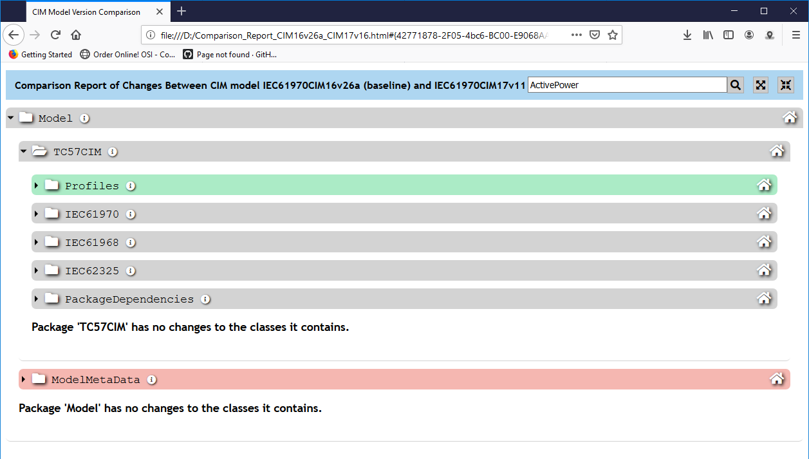
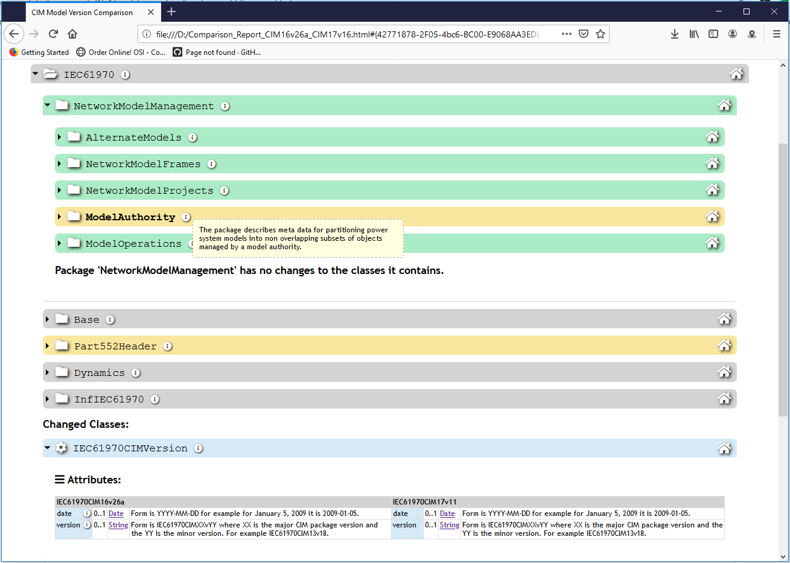
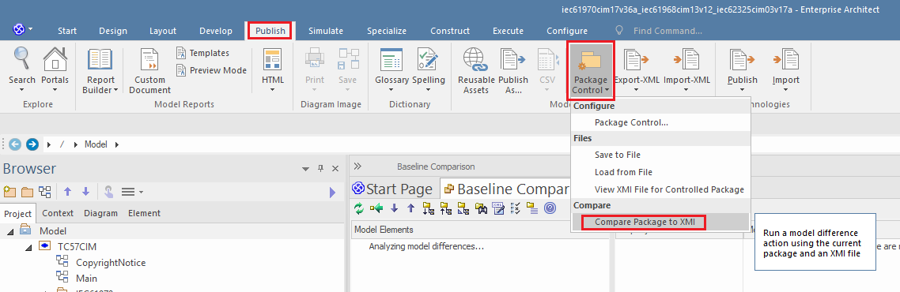
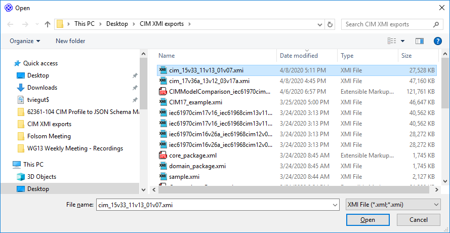

cim-compare
===========

>   Command line tool for generating CIM model comparison reports.

CIM Model Comparison Report Utility
===================================

Background
----------

The CIM Model Comparison Report utility was created to address the need for
viewing comparison reports of CIM models between two points in time. Enterprise
Architect (EA) has this feature (a.k.a. “Baseline Diff/Merge” or “Compare”) in
the Corporate Edition or above; however, this isn’t helpful for those who do not
have EA. Additionally, this feature is not inherently useful outside of EA as
only the export of results as XML files is supported which is not directly human
consumable. Therefore, this Java-based command-line utility generates a single
HTML comparison report file of all changes between a “baseline” and “target”
model. The report is easily viewable in any standard browser such as Firefox,
Chrome, IE, etc. and provides search capabilities for easily locating specific
CIM classes within the report:

**Figure 1: CIM browser-based comparison report**

The report produced utilizes a variety of ways to communicate changes to the
packages, classes, attributes and associations that exist between the models
being compared. One means is through visualization of model changes using colors
as visual indicators. New items are shown in green, deleted items are in red,
items that have moved location within the model appear as yellow, blue
represents items that were changed in some way, and finally violet is reserved
for items that are unchanged.

**Figure 2: Screenshot illustrating colors to indicate model changes**

Finally, when CIM standards are published (e.g. IEC 61970-301, IEC 61968-11 or
IEC 62325-301) it is desirable to be able to include in the release of the zip
archives of the model an informational report of all model-related changes since
the prior publication of the standard. The comparison report produced by this
utility can serve this purpose.

Overview of the CIM Model Comparison Report Utility
---------------------------------------------------

As mentioned in the previous section, EA can be used to perform a comparison
between two models and the results exported as an XML file referred to as a
“model comparison log”. The procedure for doing this is described later on in
this document. The significance of this model comparison log is that it can be
utilized as one of the possible input options to the command-line utility.
Additionally, the tool can bypass EA entirely and instead accept as input two
XMI 1.1 compliant files corresponding to the baseline and target models to be
compared.

### Java Technical Requirements

The utility ships as a self-contained executable jar file that can be run from
the command line with no additional required dependencies.

Starting with Java 9 and forward the JAXB binding APIs are no longer packaged
with the JRE and therefore the jar that is shipped contains these libraries. At
the time of this writing, the comparison utility has been tested and confirmed
to execute successfully using Java 1.8 and Java 9 through 12.

Given the large file sizes both consumed and produced by the utility
**OutOfMemory** exceptions will occur if either the default heap size is used or
too little heap is allocated from the command line. The following guidelines
should be followed:

-   For a 32-bit JRE it is recommended to specify a max heap size of at least 1G
    (i.e. 1024m) resources permitting. With a 1G heap size the execution will
    typically run a little slower. Note that the maximum theoretical heap limit
    for a 32-bit JVM is 4G. However, due to various additional constraints such
    as available swap, kernel address space usage, memory fragmentation, and VM
    overhead, in practice the limit can be much lower. On most modern 32-bit
    Windows systems the maximum heap size will range from 1.4G to 1.6G.

| **Example x86 32-bit command-line parameters:**                                               |
|-----------------------------------------------------------------------------------------------|
| java -mx1024m -jar **cim-compare.jar** iec61970cim16v26a.xmi iec61970cim17v16.xmi D:\\reports |

-   For 64 bit JREs it is recommended that the maximum heap size be increased to
    at least 2G (i.e. 2048m) if available. It has been observed that 2G is
    usually sufficient to handle the largest CIM files one might encounter.

| **Example x64 command-line parameters:**                                                      |
|-----------------------------------------------------------------------------------------------|
| java -mx2048m -jar **cim-compare.jar** iec61970cim16v26a.xmi iec61970cim17v16.xmi D:\\reports |

### Command-Line Usages

There are two possible options for command-line usage for the utility to produce
an HTML CIM model comparison report.

#### Option \#1: EA Model Comparison Logs

The first option is by specifying an **EA model comparison log** file. This
particular usage takes the following form:

| **Example EA model comparison file usage:**                                                                                     |
|---------------------------------------------------------------------------------------------------------------------------------|
| java -mx1024m -jar cim-compare.jar \<comparison-results-xml-file\> [\<output-directory-or-html-file\>] [--\<iec-package-name\>] |

*Parameters*:

**\<comparison-results-xml-file\>** (**Required**): The model comparison file.
When not specified as an absolute file path the location of the file is assumed
to be the directory the utility is being executed in.

**[\<output-directory-or-html-file\>] (Optional)**: An output directory or an
output HTML file. In the case where a directory is specified for this parameter
it must exist or execution will terminate with an appropriate error. When an
HTML file is provided it may be specified as an absolute file path or as simply
the name of the HTML file to be generated. If not specified then the application
will generate an HTML file whose name is derived from the two input files.

**[--\<iec-package-name\>] (Optional):** The root package to compare and
generate the comparison report on. Appearing at the end of the command-line, the
package must exist in both the baseline and target models (e.g. --IEC61970,
--IEC61968, --IEC62325, --TC57CIM, etc.) and be specified with two leading
dashes (-). Note that when no IEC package name is specified that the report is
generated from the root package in the models.

| **Command Line Examples:**                                                                                        |
|-------------------------------------------------------------------------------------------------------------------|
| java -jar cim-compare.jar "C:\\CIM XMI exports\\CIM15v33_CIM16v26a_EA_Comparison_Report.xml" "C:\Diff_Reports\" |
| java -jar cim-compare.jar CIM15v33_CIM16v26a_EA_Comparison_Report.xml "C:\Diff_Reports\"                        |
| java -jar cim-compare.jar CIM15v33_CIM16v26a_EA_Comparison_Report.xml "C:\Diff_Reports\" --IEC61968             |
| java -jar cim-compare.jar CIM15v33_CIM16v26a_EA_Comparison_Report.xml ComparisonReport_15v33_16v26a.html          |
| java -jar cim-compare.jar CIM15v33_CIM16v26a_EA_Comparison_Report.xml                                             |
| java -jar cim-compare.jar CIM15v33_CIM16v26a_EA_Comparison_Report.xml --IEC61970                                  |

#### Option \#2: XMI Baseline and Target Models

The second usage option allows one to bypass Enterprise Architect and directly
specify two XMI 1.1 compliant files representing the **baseline** and **target**
models respectively. In this scenario the command-line usage takes the following
form:

| **Example EA model baseline and target model input files usage:**                                                                                     |
|-------------------------------------------------------------------------------------------------------------------------------------------------------|
| java -mx1024m -jar cim-compare.jar \<baseline-model-xmi-file\> \<target-model-xmi-file\> [\<output-directory-or-html-file\>] [--\<iec-package-name\>] |

*Parameters*:

**\<baseline-model-xmi-file\>** (**Required**): An XMI 1.1 compliant baseline
model file exported from EA. When not specified as an absolute file path the
location of the file is assumed to be the directory the utility is being
executed from.

**\<target-model-xmi-file\>** (**Required**): An XMI 1.1 compliant target model
file exported from EA. When not specified as an absolute file path the location
of the file is assumed to be the directory the utility is being executed from.

**[\<output-directory-or-html-file\>] (Optional)**: An output directory or an
output HTML file. In the case where a directory is specified for this parameter
it must exist or execution will terminate with an appropriate error. When an
HTML file is provided it may be specified as an absolute file path or as simply
the name of the HTML file to be generated. If not specified then the application
will generate an HTML file whose name is derived from the two input files.

**[--\<iec-package-name\>] (Optional):** The root package within the models from
which to start the comparison report from. Appearing at the end of the
command-line, when specified the package must exist in both the baseline and
target models (e.g. --IEC61970, --IEC61968, --IEC62325, --TC57CIM, etc.) and be
specified with two leading dashes (-). Note that when no IEC package name is
specified that the report is generated from the root package in the models.

| **Command Line Examples:**                                                                                        |
|-------------------------------------------------------------------------------------------------------------------|
| java -jar cim-compare.jar "C:\CIM XMI exports\CIM15v33.xmi" "C:\CIM XMI exports\CIM16v26a.xmi" "C:\Reports\" 		|
| java -jar cim-compare.jar CIM15v33.xmi CIM16v26a.xmi "C:\Reports\"                        						|
| java -jar cim-compare.jar CIM15v33.xmi CIM16v26a.xmi "C:\Reports\CIM15v33_CIM16v26a_ComparisonReport.html"		|
| java -jar cim-compare.jar CIM15v33.xmi CIM16v26a.xmi CIM15v33_CIM16v26a_ComparisonReport.html          			|
| java -jar cim-compare.jar CIM15v33.xmi CIM16v26a.xmi CIM15v33_CIM16v26a_ComparisonReport.html --IEC62325     |                                    

Procedures for Model Comparisons in Enterprise Architect
--------------------------------------------------------

A model comparison can be performed in EA using its Compare Utility, otherwise
known as a Diff (see:
<https://sparxsystems.com/enterprise_architect_user_guide/15.1/model_repository/differences.html>).

A compare is performed between two models each representing two different points
in the timeline of the evolution of the CIM. The term “target” is used to
describe the current (or latest) version of the CIM that is the target of the
comparison. The term “baseline” is used to describe the historical model against
which the “target” model is to be compared against to determine what has
changed.

The procedure to execute a comparison is done in the following manner
(screenshots are from EA v15.1):

-   First, from within EA load the “baseline” (or older) model and select the
    top-level package of the CIM.

-   Once selected, select the Publish menu as shown in the screenshot and select
    “Other Formats…”

-   Export the CIM package as an **XMI 1.1** compliant file of the older model
    with which to perform the comparison against. The only requirement in the
    “Publish Model Package” dialog is that the “UML 1.2 (XMI 1.1)” format be
    selected as the export format. In the screenshot below of the export dialog
    it should be noted that the “Export Diagrams” and “Unisys/Rose Format” may
    or may not be selected as part of the **XMI 1.1** export. They play no role
    as part of the processing done by the command line utility.

*Important*: EA only supports comparisons against **XMI 1.1** files. If
attempting to compare a model against an XMI file that is not in the XMI 1.1
format the following error will be presented:

-   Second, the newer CIM model with which to perform the comparison on should
    be opened in EA. This is typically done by simply opening the EA project
    file. For the purposes of the Compare Utility, this is the “target” model
    which EA will perform diff against the **XMI 1.1** file of the older
    “baseline” CIM model.

-   Once the “target” model has been loaded in EA you should ensure that the
    following settings in the “Baseline Compare Options” dialog are set before
    running the Compare Utility:

To display this dialog, either:

-   Click on the Options button on the 'Package Baselines' dialog, or

-   Click on the 'Compare Options' icon in the 'Compare Utility' view toolbar

-   The final step is to select the “baseline” **XMI 1.1** file that was
    exported in the prior steps and which you want to compare the “target” model
    against.

>   Then chose the file…

>   Once selected the comparison will begin. The comparison process is known to
>   take a number of minutes to complete given the size of the CIM models.

-   When the comparison is completed select the root Model package and right
    mouse click and select the “Log to XML…” menu item. This will save the
    “model comparison log” XML file to the file system which can then be used as
    input into the utility.

One to two paragraph statement about your product and what it does.

Installation
------------

OS X & Linux:

~~~~~~~~~~~~~~~~~~~~~~~~~~~~~~~~~~~~~~~~~~~~~~~~~~~~~~~~~~~~~~~~~~~~~~~~~~~~~~~~
npm install my-crazy-module --save
~~~~~~~~~~~~~~~~~~~~~~~~~~~~~~~~~~~~~~~~~~~~~~~~~~~~~~~~~~~~~~~~~~~~~~~~~~~~~~~~

Windows:

~~~~~~~~~~~~~~~~~~~~~~~~~~~~~~~~~~~~~~~~~~~~~~~~~~~~~~~~~~~~~~~~~~~~~~~~~~~~~~~~
edit autoexec.bat
~~~~~~~~~~~~~~~~~~~~~~~~~~~~~~~~~~~~~~~~~~~~~~~~~~~~~~~~~~~~~~~~~~~~~~~~~~~~~~~~

Usage example
-------------

A few motivating and useful examples of how your product can be used. Spice this
up with code blocks and potentially more screenshots.

*For more examples and usage, please refer to the [Wiki][wiki].*

Development setup
-----------------

Describe how to install all development dependencies and how to run an automated
test-suite of some kind. Potentially do this for multiple platforms.

~~~~~~~~~~~~~~~~~~~~~~~~~~~~~~~~~~~~~~~~~~~~~~~~~~~~~~~~~~~~~~~~~~~~~~~~~~~~~~~~
make install
npm test
~~~~~~~~~~~~~~~~~~~~~~~~~~~~~~~~~~~~~~~~~~~~~~~~~~~~~~~~~~~~~~~~~~~~~~~~~~~~~~~~

Release History
---------------

-   1.0.0

    -   Initial Release

-   0.0.1

    -   Work in progress

Meta
----

Distributed under the MIT license. See `LICENSE` for more information.

<https://github.com/CIMug-org/cim-compare>
