# cim-compare

  
\[[GitHub Repo](https://github.com/cimug-org/cim-compare)\]
      
The **cim-compare** project is a command line tool for generating CIM model comparison reports. For an example report visit [comparison-report.html](https://cim-compare.ucaiug.io/example-comparison-report/comparison-report.html).

To download this setup and usage guide as a standalone PDF click [here](cim-compare-2.0.0-users-guide.pdf).

## Table of Contents
- [Home](#cim-compare)
- [Latest Release](#latest-release)
  - [What's New in 2.0.0](#whats-new-in-200)
- [Overview: CIM Model Comparison Reports](#overview-cim-model-comparison-reports)
- [Reading a Comparison Report](#reading-a-comparison-report)
  - [Report Layout](#report-layout)
  - [Status Colors](#status-colors)
  - [Class Details](#class-details)
  - [Diagrams](#diagrams)
  - [Finding Things](#finding-things)
  - [Keyboard Shortcuts](#keyboard-shortcuts)
  - [Supported Browsers](#supported-browsers)
- [Setup & Configuration](#setup--configuration)
  - [Java Technical Requirements](#java-technical-requirements)
  - [Azul OpenJDK](#azul-openjdk)
    - [Download 32-bit Java 17](#download-32-bit-java-17)
    - [Download 64-bit Java 17](#download-64-bit-java-17)
  - [Important Setup Considerations](#important-setup-considerations)
  - [Warning: Potential Configuration Pitfalls](#warning-potential-configuration-pitfalls)
- [Command Line Usage](#command-line-usage)
  - [Option #1: Enterprise Architect .EAP or .QEA Project Files as Input](#option-1-enterprise-architect-eap-or-qea-project-files-as-input)
  - [Option #2: XMI Baseline and Destination Models as Input](#option-2-xmi-baseline-and-destination-models-as-input)
  - [Option #3: EA Model Comparison Logs as Input](#option-3-ea-model-comparison-logs-as-input)
  - [Output Files](#output-files)
- [Enterprise Architect XMI Export Procedures](#enterprise-architect-xmi-export-procedures)
- [License](#license)
  - [Third-Party Software](#third-party-software)


## Latest Release

2.0.0  

 - For release notes describing the latest features and/or fixes visit [latest release](https://github.com/cimug-org/cim-compare/releases).
 - To directly download the latest release of the cim-compare command-line application click [cim-compare-2.0.0.jar](https://github.com/cimug-org/cim-compare/releases/download/2.0.0/cim-compare-2.0.0.jar).

### What's New in 2.0.0

- **A redesigned HTML report** ([#38](https://github.com/cimug-org/cim-compare/issues/38)): a package outline, search, status filters, links between classes, GUIDs, word-level redlines of changed descriptions, and keyboard shortcuts. Reports are much smaller: the example report is under 1 MB, down from 5.9 MB. See [Reading a Comparison Report](#reading-a-comparison-report).
- **Only changes are reported by default** ([#42](https://github.com/cimug-org/cim-compare/issues/42)). The new `--full` option includes identical items as well. `--minimal` is still accepted but no longer needed.
- **`--package` works across renamed packages** ([#49](https://github.com/cimug-org/cim-compare/issues/49)): for example `--package=Grid` when comparing CIM17 (where the package is `IEC61970`) with CIM18. If the package can't be found, **cim-compare** now stops with an error instead of comparing the whole model.
- **Fixes:** reports are no longer empty when the model's root package isn't named "Model" ([#43](https://github.com/cimug-org/cim-compare/issues/43)); `--cleanup` no longer deletes your own input files ([#53](https://github.com/cimug-org/cim-compare/issues/53)).
- **A new output file**, `<name>-enriched.xml`, written beside the report. See [Output Files](#output-files).


## Overview: CIM Model Comparison Reports

**cim-compare** generates model comparison reports between two points in time.

The term “destination” is used to describe some current version (or latest working copy) of a CIM model that is to be the target of the comparison. The term “baseline” is used to describe the **historical** model against which the “destination” model is to be compared to determine what has changed.

Enterprise Architect (Corporate Edition and above) has the capability to perform these model comparisons; however, the feature is not generally useful as results are only exportable as XML files that are not easily human readable.

The output generated by **cim-compare** is a single, self-contained HTML file covering all changes between a “baseline” and “destination” model. It needs no web server and no internet connection: open it from disk in any current browser (see [Supported Browsers](#supported-browsers)). By default the report shows only what changed; `--full` adds the unchanged items.

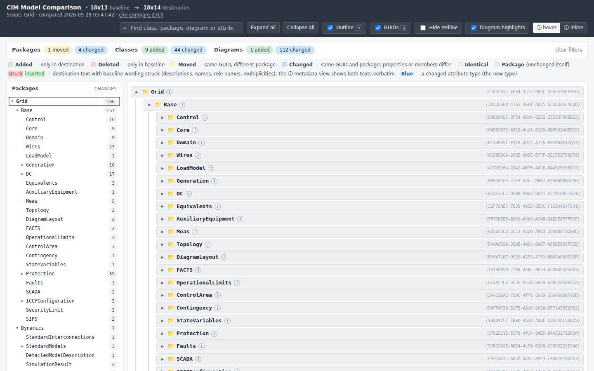

## Reading a Comparison Report

### Report Layout

- **Header** (always visible at the top): the baseline and destination versions, the scope of the comparison (the package given with `--package`, or the whole model), when the comparison was made, and the controls described below.
- **Summary**: counts of added, deleted, moved and changed packages, classes and diagrams. Click a count to show only items with that status; click more than one to combine them, and **clear filters** to show everything again.
- **Legend**: what each color means (see [Status Colors](#status-colors)).
- **Package outline** (left): every package with changes, and the number of changed classes and diagrams in it, including its sub-packages. Click a package to jump to it; the package you are reading is highlighted as you scroll. Turn it off with the **Outline** checkbox or the `o` key. It is hidden in narrow windows and when printing.
- **Package tree** (right): packages, and within each package its classes and then its diagrams, grouped by status in the order Deleted, Added, Moved, Changed. Click a row to open or close it; **Expand all** and **Collapse all** open or close everything, and Alt-click on an arrow opens a package and everything in it.

### Status Colors

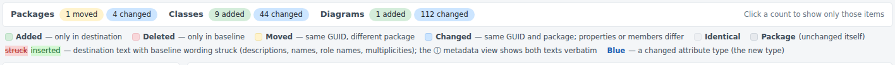

| Color | Status | Meaning |
|---|---|---|
| Green | **Added** | Only in the destination model. |
| Red | **Deleted** | Only in the baseline model. |
| Yellow | **Moved** | Same element (same GUID), now in a different package. The row says which package it came from. |
| Blue | **Changed** | Same element, same package; some of its properties, attributes or links differ. |
| Grey | **Identical** | Unchanged. Shown only with `--full`. |

The status is also written on each row (ADDED, DELETED, MOVED, CHANGED), so the report can be read without relying on color. A renamed element shows both names, as `OldName → NewName`.

### Class Details

Open a class to see what changed in it, in this order:

1. **Description** – the class notes. When they changed, the baseline text appears beside the destination text, and the destination is *redlined*: wording removed since the baseline is struck through in red and new wording is highlighted in green. When most of a text was rewritten, the whole old text is struck through and the whole new text inserted, which is easier to read than a word-by-word comparison.
2. **Metadata** – the class properties that changed (stereotype, abstract, alias and so on), baseline beside destination.
3. **Attributes** – one row per changed attribute: its type and multiplicity in the baseline and in the destination, and its notes, redlined. In the Destination column a changed type is shown as the new type in blue, and a changed multiplicity is redlined. A renamed attribute shows `old → new` in the Attribute column. A new attribute shows "does not exist" in the baseline column; a deleted one shows "removed from model" in the destination column.
4. **Links** – generalizations, associations and aggregations, each as a card showing both ends with their roles and multiplicities in the baseline and in the destination, followed by the changed properties of the source end and the target end. On the destination line a changed role name is shown as the new name in blue, and a changed multiplicity is redlined.

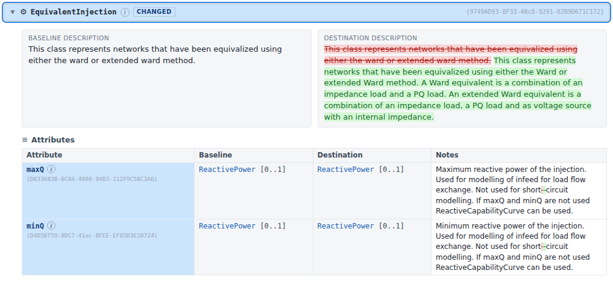

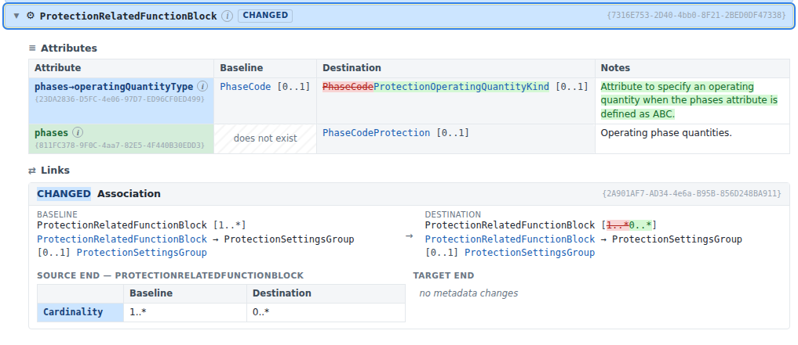

Other controls in the header:

- **ⓘ hover / ⓘ inline** – the ⓘ next to a package, class or attribute shows all of its properties, with the baseline and destination values in full, including the unredlined baseline notes. In **hover** mode (the default) they appear in a pop-up when you point at the ⓘ; click it to keep the pop-up open. In **inline** mode they appear in the page.
- **Hide redline** – shows the destination text without the struck and inserted markings.

Redlining is used only for descriptions and notes (of classes, attributes, diagrams, packages and association ends) and for multiplicities. Names are never redlined: a renamed element shows `old → new` in its name, and a changed name in a property table (for example in the ⓘ pop-up) shows just the new name in the Destination column.
- **GUIDs** – each package, class, attribute and link shows its GUID, in grey at the right. Turn them off with the checkbox or the `g` key. The GUID shows when an element was renamed rather than replaced: a renamed element keeps its GUID.

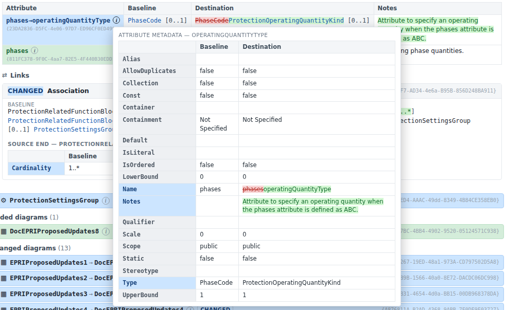

Added and deleted classes are shown compactly (their attributes and links as a simple list); **Show full metadata for this new class** (or **removed class**) opens the complete tables.

### Diagrams

With `--include-diagrams`, each changed diagram shows its changed properties and the baseline and destination images side by side. Click an image to enlarge it; press `Esc` to close. Diagrams whose only differences are in layout (element positions) are not listed.

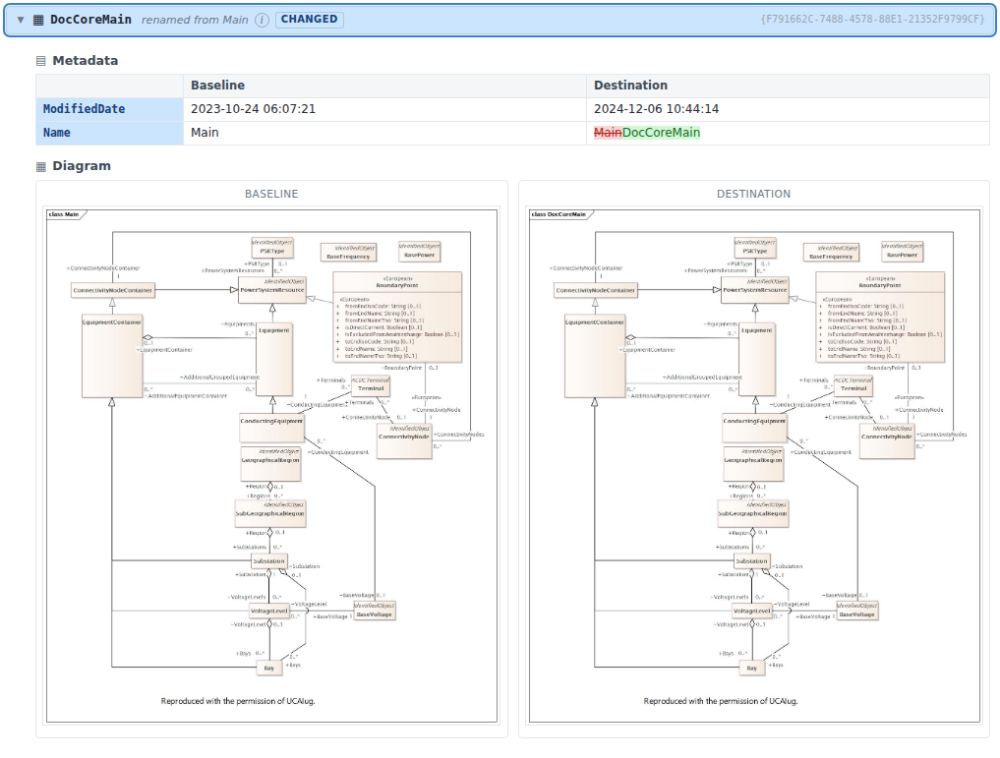

### Finding Things

- **Search** (or press `/`): type part of the name of a package, class, diagram or attribute. Matches appear as you type, with their package; choose one with the arrow keys and `Enter`, or click it. The report opens at that element and highlights it.

  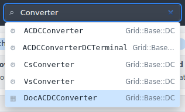
- **Links to other classes**: attribute types and link ends that are classes in the model are links. Following one opens the class; the browser's **Back** button returns you to where you were.
- **Links into a report**: every element has an address of the form `comparison-report.html#EAID_...` (the element's GUID). Copy it from the address bar after opening an element to send someone straight to it.

### Keyboard Shortcuts

| Key | Action |
|---|---|
| `/` | Search |
| `↑` `↓` | Previous / next row (in search results: previous / next match) |
| `←` `→` | Close / open the current row |
| `Enter` | Open or close the current row (in search: go to the match) |
| `Home` | Back to the top (the browser's Back button returns you) |
| `o` | Show / hide the package outline |
| `g` | Show / hide GUIDs |
| `Esc` | Clear the search, close a pop-up or an enlarged diagram |

### Supported Browsers

Current versions of Chrome, Edge, Firefox and Safari. Internet Explorer is not supported. Printing expands the whole report and leaves out the header and the outline.


## Setup & Configuration

### Java Technical Requirements

**cim-compare** ships as a fully self-contained executable jar file with no external dependencies. To execute it requires that an appropriate release of Java be installed on your system. 

Given the large file sizes consumed and produced by the utility, **OutOfMemory** exceptions occur if the default heap (memory) size is used. The following guidelines should be followed:

> For a 32-bit JRE it is recommended to specify a max heap size of at least 1G (i.e. 1024m) resources permitting. With a 1G heap size the execution will typically run slower. Note that the maximum theoretical heap limit for a 32-bit JVM is 4G. However, due to various additional constraints such as available swap, kernel address space usage, memory fragmentation, and VM overhead, in practice the limit can be much lower. On most modern 32-bit Windows systems the maximum heap size will range from 1.4G to 1.6G.

```
java -Xmx1G -jar cim-compare-2.0.0.jar iec61970cim16v26a.xmi iec61970cim17v16.xmi D:\reports
```

> For 64 bit JREs it is recommended that the maximum heap size be increased to at least 2G (i.e. 2048m) but more if available. It has been observed that 2G is minimally sufficient to handle larger CIM models one might encounter. In the below example 4G is being allocated.

```
java -Xmx4G -jar cim-compare-2.0.0.jar iec61970cim16v26a.qea iec61970cim17v16.qea D:\reports
```

> Most of that memory is needed to export and compare the models. Producing the report itself takes much less: for a full-model CIM17v40 → CIM18v16 comparison (a 92 MB comparison XML), the report step needed less than 1G, including with `--full`.

> For freely available downloads of Java visit [Azul Systems'](https://en.wikipedia.org/wiki/Azul_Systems) download site at [Download Azul JDKs](https://www.azul.com/downloads/?package=jdk#zulu).

### Azul OpenJDK

We recommend end-users use Azul OpenJDK (Zulu) which is Azul Systems’ free, TCK-certified binary distribution of the OpenJDK — the open-source implementation of the Java Platform, Standard Edition (Java SE). Azul provides reliable, production-ready Java runtimes for enterprises and developers who want an open-source alternative to Oracle JDK. OpenJDK is:

* 100% open-source and fully compliant with Oracle’s Java SE standard.
* Offers builds for many Java versions (e.g., 6, 7, 8, 11, 17, 21, and newer).
* Available for multiple platforms: Windows, Linux, macOS, and others.
* Includes free updates, security patches, and optional commercial support.

When downloading there are special considerations related to the 32-bit version. As of Azul's [April 2025 supported-platforms list](https://docs.azul.com/core/supported-platforms), Java 8, 11, 17, 21 — are available in both Windows x86 32‑bit and 64‑bit, as well as Linux x86 32‑bit and 64‑bit. However, there are no 32-bit builds for the latest releases:

* **Java 24 (OpenJDK 24)** — The supported platform table explicitly states that Azul Zulu builds of **Java 24 are only offered for 64‑bit Windows**, with no mention of 32‑bit availability.
* The broader Azul download includes the latest versions (Java 23, 21, 17, etc.) but **only have available 64‑bit options for newer platform support**.

The reason for the shift is that it reflects a broader trend. OpenJDK deprecated Windows 32‑bit, targeting removal in JDK 23+, making it increasingly rare to see 32‑bit builds in newer OpenJDK distributions. Therefore, though **cim-compare** is not tied to Java 17 and can run on newer releases of OpenJDK, the below provided download links simply point to Java 17 where both 32-bit and 64-bit versions are available.

#### Download 32-bit Java 17

If you are looking to run comparisons of `.eap` files then you'll need 32-bit Java. To directly download a 32-bit Java 17 click the image below:

[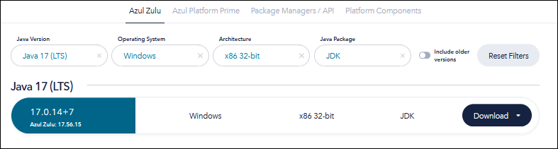](https://www.azul.com/core-post-download/?endpoint=zulu&uuid=7669f8bc-8512-4993-8598-8a65866bad5c)

#### Download 64-bit Java 17

If you are looking to run comparisons of `.qea` files then you'll need 64-bit Java. To directly download a 64-bit Java 17 click the image below:

[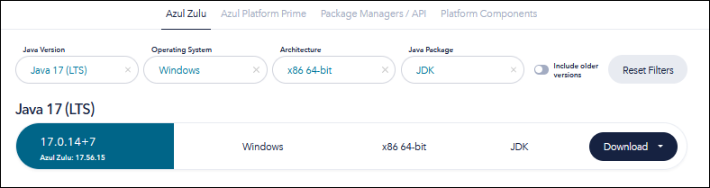](https://www.azul.com/core-post-download/?endpoint=zulu&uuid=1523a07f-3c0b-4869-8eea-a4276f0ea944)


### Important Setup Considerations

> The **cim-compare** command-line option described in the [Option #1: Enterprise Architect .EAP or .QEA Project Files as Input](#option-1-enterprise-architect-eap-or-qea-project-files-as-input) section requires EA's COM automation API. Consequently, if you plan to use it you are required to have a licensed version of Sparx Enterprise Architect (EA) installed for the COM automation API to work. The EA API and the `eaapi.jar` file act as interfaces to the Enterprise Architect application. The following explains why:
> 
> - Dependency on the Sparx Enterprise Architect Application:
>    - The EA COM API and `eaapi.jar` rely on the backend functionality of the Enterprise Architect software. They act as a bridge to interact with the models, diagrams, and repositories managed by EA.
>    - Without the Enterprise Architect application installed, there is no core functionality or data source for the API to connect to.
> - Enterprise Architect COM Object:
>    - The `SSJavaCOM.dll` and `SSJavaCOM64.dll` are COM interface wrappers that requires Enterprise Architect's COM objects to function. These COM objects are installed as part of the Enterprise Architect installation process.
> - Licensing Requirements:
>    - Sparx Enterprise Architect is a licensed product, and the API requires a valid license to access its features. Without a licensed installation of Enterprise Architect, the API calls will fail or be severely limited.
> - Runtime Dependency:
>    - When using the COM automation interface, **cim-compare** initializes and communicates with an EA process. The underlying API calls interact with the installed Enterprise Architect software to perform operations like exporting `.xmi` files from an `.eap` or `.qea` file.
>   
> The COM interface wrappers ship with each release of Sparx EA and are delivered in an installation directory similar to:
>
> `%WINDOWS_PROGRAM_FILES%\Sparx Systems\EAxx\Java API  (e.g. "C:\Program Files\Sparx Systems\EA16\Java API")`
>
> The purpose of each is:
> 
> - `SSJavaCOM.dll` - the 32-bit COM Module DLL (Dynamic Linked Library) that **cim-compare** will link to when a 32-bit Java JVM/JRE is used to run `cim-compare-2.0.0.jar` from the command line (i.e. required when processing 32-bit .EAP project files).
>
> - `SSJavaCOM64.dll` - the 64-bit COM Module DLL that **cim-compare** will link to when a 64-bit Java JVM/JRE is used to run `cim-compare-2.0.0.jar` from the command line (i.e. required when processing 64-bit .QEA project files)
>   	
> **cim-compare** communicates to the appropriate COM Module DLL depending on the particular JVM (32-bit or 64-bit) being used on the command line. Which DLL COM interface wrapper to load and link to is determined at runtime. 
>
> Another key requirement is that these two DLL COM interface wrappers must be available to Java at runtime. This is done on the command line by specifying their directory location using the `-Djava.library.path` JVM parameter.
> 

To use **cim-compare** on a system with a dual 32-bit and 64-bit Sparx EA installation (e.g. EA 15.x and EA 16.x) you will need to have a configuration similar to the following:

```
C:\
├── cim-compare
│   ├── cim-compare-2.0.0.jar   (the latest downloaded from https://cim-compare.ucaiug.io)
│   ├── cim-compare-2.0.0.bat   (example batch file for execution)
│   ├── ea15
│   │   ├── SSJavaCOM.dll       (copied from "C:\Program Files (x86)\Sparx Systems\EA15\Java API")
│   │   └── SSJavaCOM64.dll     (copied from "C:\Program Files (x86)\Sparx Systems\EA15\Java API")
│   ├── ea16
│   │   ├── SSJavaCOM.dll       (copied from "C:\Program Files\Sparx Systems\EA16\Java API")
│   │   └── SSJavaCOM64.dll     (copied from "C:\Program Files\Sparx Systems\EA16\Java API")
│   ├── cim17v40.eap
│   ├── cim18v02.eap
│   ├── cim18v12.qea
│   └── cim18v13.qea
├── Program Files (x86)         (32-bit JVM installation required for processing 32-bit .eap files)
│   └── Zulu
│       └── zulu-17
│           └── bin
│               └── java.exe
├── Program Files               (64-bit JVM installation required for processing 64-bit .qea files)
│   └── Zulu
│       └── zulu-17
│           └── bin
│               └── java.exe
└── ...
```
Of importance is that each EA installation's set of DLL files be located in their own directory. This will allow for the ability to isolate where Java looks for its COM Modules based on the specific release of Sparx EA. 

Following is a set of command lines based on the above example configuration and file system structure. The first illustrates comparison report generation for 32-bit `.eap` files and the second for 64-bit `.qea` files. The command lines are split over several lines with `^`, the Windows command prompt's line-continuation character, so they can be pasted into a command prompt as shown.
 
```
"C:\Program Files (x86)\Zulu\zulu-17\bin\java.exe" -Xmx1G -Djava.library.path="C:\cim-compare\ea15" ^
  -jar cim-compare-2.0.0.jar cim17v40.eap cim18v02.eap comparison-report.html ^
  --include-diagrams --image-type=JPG
```

The above 32-bit command line example uses:
 - a 32-bit Java 17 JRE/JVM  (i.e. `"C:\Program Files (x86)\Zulu\zulu-17\bin\java.exe"`)
 - a max heap size of 1G (i.e. 1GB specified via `-Xmx1G` or `-Xmx1024m`)
 - the 32-bit COM DLL loaded from the `C:\cim-compare\ea15` directory (i.e. via `-Djava.library.path="C:\cim-compare\ea15"`) 
 - `cim17v40.eap` as the input baseline model (i.e. a 32-bit EA project file indicated by the `.eap` extension)
 - `cim18v02.eap` as the input destination model (i.e. a 32-bit EA project file indicated by the `.eap` extension)
 - `comparison-report.html` as the name of the generated report
 - the inclusion of changed diagrams in the report (i.e. `--include-diagrams`)
 - JPG for the type of diagrams (i.e. `--image-type=JPG`)

```
"C:\Program Files\Zulu\zulu-17\bin\java.exe" -Xmx4G -Djava.library.path="C:\cim-compare\ea16" ^
  -jar cim-compare-2.0.0.jar cim17v40.qea cim18v02.qea comparison-report.html ^
  --include-diagrams --image-type=JPG
```
The above 64-bit command line example uses:
 - a 64-bit Java 17 JRE/JVM (i.e. `"C:\Program Files\Zulu\zulu-17\bin\java.exe"`)
 - a max heap size of 4G (i.e. 4GB specified via `-Xmx4G` or `-Xmx4096m`)
 - the 64-bit COM DLL loaded from the `C:\cim-compare\ea16` directory (i.e. via `-Djava.library.path="C:\cim-compare\ea16"`) 
 - `cim17v40.qea` as the input baseline model (i.e. a 64-bit EA project file indicated by the `.qea` extension)
 - `cim18v02.qea` as the input destination model (i.e. a 64-bit EA project file indicated by the `.qea` extension)
 - `comparison-report.html` as the name of the generated report
 - the inclusion of changed diagrams in the report (i.e. `--include-diagrams`)
 - JPG for the type of diagrams (i.e. `--image-type=JPG`)
 
### Warning: Potential Configuration Pitfalls

> A common "gotcha" that users run into is that when using `.eap` project files as input into **cim-compare**, they unknowingly use 64-bit Java instead of 32-bit Java (and vice versa). It is a hard requirement that when comparing two `.qea` files 64-bit Java **must** be used and, conversely, when comparing two `.eap` files 32-bit Java **must** be used. 
>
> Noteworthy in the previous command line examples is that `java` has been expressly qualified as either `"C:\Program Files (x86)\Zulu\zulu-17\bin\java.exe"` or `"C:\Program Files\Zulu\zulu-17\bin\java.exe"` to ensure that the correct version of Java is used. This is not a requirement but rather one method to eliminate this as a pitfall.
>
> If choosing to simplify the command line via use of the default installation of Java such as:
>
> `java -Xmx4G -Djava.library.path="C:\cim-compare\ea16" -jar cim-compare-2.0.0.jar ...`
> 
> ...then it is suggested that you confirm the bit-wise version of your default Java installation. The following java command will result in output that should indicate if your default installation is 32-bit. This either by explicitly stating as such or by including the installation directory which for 32-bit will be located in `C:\Program Files (x86)\...`. Note that for many of the newest releases of Java, if not explicitly stated as being 32-bit, it is then implied to be 64-bit as illustrated in this example:
>
> ```
> C:\>java -version
> openjdk version "17.0.13" 2024-10-15 LTS
> OpenJDK Runtime Environment Zulu17.54+21-CA (build 17.0.13+11-LTS)
> OpenJDK Client VM Zulu17.54+21-CA (build 17.0.13+11-LTS, mixed mode, emulated-client)
> ```
> 
> If command line execution results in an error similar to the following then it typically is an indicator that the Java executable being used does not bit-wise match the project files being input:
>
> ```
> java.lang.Exception: Internal application error.
>        at org.sparx.Repository.comGetModels(Native Method)
>        at org.sparx.Repository.GetModels(Repository.java:805)
>        at org.cimug.compare.app.CIMModelComparisonGenerator.parseFileArguments(CIMModelComparisonGenerator.java:492)
>        at org.cimug.compare.app.CIMModelComparisonGenerator.main(CIMModelComparisonGenerator.java:107)
>ERROR:  Terminating XMI export processing for EA project file [CIMMarket04v16a.eap] due to an unexpected exception.
> ```
> 
> Finally, keep in mind that when using the default installation you could have a bit-wise compliant version of Java and have no issues creating reports only later to discover that **cim-compare** no longer work. Such a scenario can occur when between uses of cim-compare, software is installed on your system that, as part of its installation process, installs a newer 64-bit version of Java. This would then make this latest installation of Java your default. This typically happens "under the radar" and should be one of the first things checked when troubleshooting potential issues. 
>

## Command Line Usage

The **cim-compare** utility has three possible command-line options to produce comparison reports as described next. In the examples, long command lines are split with `^`, the Windows command prompt's line-continuation character, so they can be pasted into a command prompt as they are. Directory and file paths that contain spaces are given in quotes.

### Option \#1: Enterprise Architect .EAP or .QEA Project Files as Input

The preferred usage is to provide two Enterprise Architect `*.eap` or `*.qea` files for the "baseline" and "destination" input files.  Using these file types eliminates the need to manually export XMI and diagrams from EA as described later in the [Enterprise Architect XMI Export Procedures](#enterprise-architect-xmi-export-procedures) section. When using these file types as inputs on the command line both "baseline" and "destination" files must be either 32-bit (i.e. `*.eap`) or 64-bit (i.e. `*.qea`) files. Note that the processing of 64-bit `*.qea` files is more performant.

The command-line usage for this option takes the following form:

```
java [<jvm-parameter-1>]...[<jvm-parameter-n>] -jar cim-compare-2.0.0.jar
     <baseline-model-file> <destination-model-file> [<output-directory-or-html-file>]
     [--package=<package-name>] [--full] [--include-diagrams] [--image-type=<image-file-extension>]
     [--zip] [--cleanup]
```

*Parameter Details*:

`[<jvm-parameter-x>]` **(Optional)**: A JVM (Java Virtual Machine) parameter that may be needed for execution. JVM parameters are configurations used to control the behavior of the JVM at runtime and take a form such as `-Xmx1G`, `-Xmx4G` or `-Dfile.encoding=UTF-8`. These parameters can influence memory usage, garbage collection, system properties, debugging, and performance tuning. JVM parameters are passed as command-line arguments when starting a Java application and if used should **appear first** in the sequence of command line arguments (before `cim-compare-2.0.0.jar`). This is necessary so that **cim-compare** does not try to process them as part of its command line arguments which should always appear after `cim-compare-2.0.0.jar`. Note that for this Option #1 the `-Djava.library.path=<directory>` JVM parameter is required as will be described later.

`<baseline-model-file>` **(Required)**: An Enterprise Architect baseline `.eap` or `.qea` model file. When not specified as an absolute file path the location is assumed to be the directory **cim-compare** is being executed from.

`<destination-model-file>` **(Required)**: An Enterprise Architect destination `.eap` or `.qea` model file. When not specified as an absolute file path the location is assumed to be the directory **cim-compare** is being executed from.

`[<output-directory-or-html-file>]` **(Optional)**: An output directory or an output HTML file. In the case where a directory is specified but does not exist it will be created. The same is true for the parent directory of a specified HTML file if it does not exist. When an HTML file is provided it may be specified as an absolute file path or as the simple name of an HTML file to be generated. If this command line option is not specified then **cim-compare** will generate an HTML file whose name is derived from the two input files.

`[--package=<package-name>]` **(Optional)**: The package to compare, together with everything below it (e.g. `--package=Grid`, `--package=IEC61970`, `--package=IEC61968`, `--package=IEC62325`). The package is looked up by name in both models, root nodes included. If it was renamed between the two versions, either name can be given: for example, comparing CIM17 (where the package is `IEC61970`) with CIM18 (where it is `Grid`), **cim-compare** finds the package by name in one model and by its GUID in the other. If the package can't be found in both models, **cim-compare** stops with an error. When `--package` is not given, the whole model is compared.

`[--full]` **(Optional)**: Include identical packages, classes, attributes, links and diagrams in the report as well as the changes. They are shown collapsed and in grey. Without `--full` the report contains only what changed.

`[--minimal]` **(Optional)**: Accepted so that command lines written for 1.x keep working, but has no effect: the report contains only changes by default since 2.0.0.

`[--include-diagrams]` **(Optional)**: Indicates that diagram images should also be exported from EA along with the XMI exports. The type of images to be exported should also be provided using the `--image-type` option. When not specified the image type will default to JPG.

`[--image-type=<image-file-extension>]` **(Optional)**: The type of diagrams to be exported from EA (i.e. JPG, GIF, PNG, BMP, or EMF). This can be skipped for JPG images as JPG is used as the default value when the option is not specified. This command line option is only used when `--include-diagrams` also appears on the command line.

`[--zip]` **(Optional)**: When specified **cim-compare** will package up the generated report and any associated diagrams into a single ZIP archive. It is most often utilized for packaging the report when diagram images are included and can help simplify distribution. The ZIP archive contains the report and, with `--include-diagrams`, the `Images-baseline` and `Images-destination` folders; it never contains the XMI or XML files.

`[--cleanup]` **(Optional)**: Used with `--zip`. Deletes the files and folders created during report generation, leaving the ZIP archive: here the report, the exported XMI files, the comparison XML, the enriched XML and the image folders. Your two EA project files are not touched.

**Command Line Examples:**

```
java -Xmx1G -Djava.library.path="C:\cim-compare\ea15" -jar cim-compare-2.0.0.jar ^
  "C:\exports\15v33.eap" "C:\exports\CIM16v26a.eap" "C:\reports"

java -Xmx4G -Djava.library.path="C:\cim-compare\ea16" -jar cim-compare-2.0.0.jar ^
  "C:\exports\15v33.qea" "C:\exports\CIM16v26a.qea" "C:\reports"

java -Xmx1G -Djava.library.path="C:\cim-compare\ea15" -jar cim-compare-2.0.0.jar ^
  "C:\exports\15v33.eap" "C:\exports\CIM16v26a.eap" --package=IEC61970

java -Xmx1G -Djava.library.path="C:\cim-compare\ea15" -jar cim-compare-2.0.0.jar ^
  CIM15v33.eap CIM16v26a.eap C:\reports --include-diagrams --zip

java -Xmx4G -Djava.library.path="C:\cim-compare\ea16" -jar cim-compare-2.0.0.jar ^
  CIM15v33.qea CIM16v26a.qea C:\reports\CIM15v33_CIM16v26a_ComparisonReport.html --full

java -Xmx1G -Djava.library.path="C:\cim-compare\ea15" -jar cim-compare-2.0.0.jar ^
  CIM15v33.eap CIM16v26a.eap --package=IEC62325 --include-diagrams --image-type=GIF --zip --cleanup

java -Xmx4G -Djava.library.path="C:\cim-compare\ea16" -jar cim-compare-2.0.0.jar ^
  CIM17v40.qea CIM18v16.qea --package=Grid --include-diagrams --zip --cleanup
```

NOTE:  The above command line examples illustrate the use of both `.eap` and `.qea` EA files as input. Where `.eap` files appear as input on the command line it is assumed that 32-bit Java is being used to execute the `.jar` file. Likewise, for `.qea` files that 64-bit Java is executed.

### Option \#2: XMI Baseline and Destination Models as Input

The second usage is to directly specify two XMI 1.1 compliant files representing the "baseline" and “destination” models exported as described later in [Enterprise Architect XMI Export Procedures](#enterprise-architect-xmi-export-procedures). In this scenario the command-line usage takes the following form:

```
java [<jvm-parameter-1>]...[<jvm-parameter-n>] -jar cim-compare-2.0.0.jar
     <baseline-model-xmi-file> <destination-model-xmi-file> [<output-directory-or-html-file>]
     [--package=<package-name>] [--full] [--include-diagrams] [--image-type=<image-file-extension>]
     [--zip] [--cleanup]
```

*Parameter Details*:

`[<jvm-parameter-x>]` **(Optional)**: A JVM (Java Virtual Machine) parameter that may be needed for execution. JVM parameters are configurations used to control the behavior of the JVM at runtime and take a form such as `-Xmx1G`, `-Xmx4G` or `-Dfile.encoding=UTF-8`. These parameters can influence memory usage, garbage collection, system properties, debugging, and performance tuning. JVM parameters are passed as command-line arguments when starting a Java application and if used should **appear first** in the sequence of command line arguments (before `cim-compare-2.0.0.jar`). This is necessary so that **cim-compare** does not try to process them as part of its command line arguments which should always appear after `cim-compare-2.0.0.jar`.

`<baseline-model-xmi-file>` **(Required)**: An XMI 1.1 compliant baseline model file exported from EA. When not specified as an absolute file path the location of the file is assumed to be the directory the utility is being executed from.

`<destination-model-xmi-file>` **(Required)**: An XMI 1.1 compliant destination model file exported from EA. When not specified as an absolute file path the location of the file is assumed to be the directory the utility is being executed from.

`[<output-directory-or-html-file>]` **(Optional)**: An output directory or an output HTML file. In the case where a directory is specified but does not exist it will be created. The same is true for the parent directory of a specified HTML file if it does not exist. When an HTML file is provided it may be specified as an absolute file path or as the simple name of an HTML file to be generated. If this command line option is not specified then **cim-compare** will generate an HTML file whose name is derived from the two input files.

`[--package=<package-name>]` **(Optional)**: The package the report starts from, together with everything below it (e.g. `--package=Grid`, `--package=IEC61970`, `--package=IEC61968`, `--package=IEC62325`). The name can be the package's name in either model, so a package renamed between the two versions (e.g. `IEC61970` → `Grid`) can be given by either name. If no package of that name is in the comparison, **cim-compare** stops with an error. When `--package` is not given, the report covers the whole model.

`[--full]` **(Optional)**: Include identical packages, classes, attributes, links and diagrams in the report as well as the changes. They are shown collapsed and in grey. Without `--full` the report contains only what changed.

`[--minimal]` **(Optional)**: Accepted so that command lines written for 1.x keep working, but has no effect: the report contains only changes by default since 2.0.0.

`[--include-diagrams]` **(Optional)**: When specified **cim-compare** indicates that diagram images should be included in the generated comparison report. Note that if the types of diagrams to be included are not JPG files then the `--image-type` option must also be used in tandem. When this option does not appear on the command line no diagrams will be included in the report.

> IMPORTANT: this command line option does not automatically export diagrams as performed in usage Option \#1.  Rather the expectation is that they be exported as part of manual exports of XMI baseline and destination models from EA and that images are hosted in folders named `<output directory>\Images-baseline` and `<output directory>\Images-destination` respectively. This must be done prior to running **cim-compare**. Refer to the [Enterprise Architect XMI Export Procedures](#enterprise-architect-xmi-export-procedures) for further details.

`[--image-type=<image-file-extension>]` **(Optional / Conditionally Required)**: Indicates the type of images (i.e. JPG, GIF, PNG, BMP, or EMF) referenced in the report. Conditionally required when the `--include-diagrams` option is used and the diagram are not JPG image files. When not specified the default image type of JPG is used. This command line option is only relevant when `--include-diagrams` also appears on the command line.

`[--zip]` **(Optional)**: When specified **cim-compare** will package up the generated report and any associated diagrams into a single ZIP archive. It is most often utilized for packaging the report when diagram images are included and can help simplify distribution. The ZIP archive contains the report and, with `--include-diagrams`, the `Images-baseline` and `Images-destination` folders (everything in them is included, so keep only the diagram images there); it never contains the XMI or XML files.

`[--cleanup]` **(Optional)**: Used with `--zip`. Deletes the files created during report generation, leaving the ZIP archive: here the report, the comparison XML and the enriched XML. Your XMI files and your `Images-baseline` and `Images-destination` folders are not deleted.

**Command Line Examples:**

```
java -Xmx2G -jar cim-compare-2.0.0.jar "C:\XMI exports\15v33.xmi" "C:\XMI exports\CIM16v26a.xmi" "C:\reports"

java -Xmx2G -jar cim-compare-2.0.0.jar "C:\XMI exports\15v33.xmi" "C:\XMI exports\CIM16v26a.xmi" --package=IEC61970

java -Xmx2G -jar cim-compare-2.0.0.jar CIM15v33.xmi CIM16v26a.xmi C:\reports --full

java -Xmx2G -jar cim-compare-2.0.0.jar CIM15v33.xmi CIM16v26a.xmi C:\reports ^
  --include-diagrams --image-type=GIF --zip --cleanup

java -Xmx2G -jar cim-compare-2.0.0.jar CIM15v33.xmi CIM16v26a.xmi C:\reports\CIM15v33_CIM16v26a_ComparisonReport.html

java -Xmx2G -jar cim-compare-2.0.0.jar CIM15v33.xmi CIM16v26a.xmi CIM15v33_CIM16v26a_ComparisonReport.html ^
  --package=IEC62325 --include-diagrams --image-type=JPG --zip
```

### Option \#3: EA Model Comparison Logs as Input

The third option is by specifying an **EA model comparison log** file as input on the command line. In order to perform this option it is first required that a comparison XML log file be generated from within Enterprise Architect.  Refer to the [EA Comparison Log Procedures](EA_COMPARE_PROCEDURES.md) for detailed information on generating XML Compare Logs from within Enterprise Architect. It is important to note that EA does not support comparisons of UML diagrams and therefore diagrams are not supported as part of reports generated using Option \#3.

This particular usage takes the following form:

```
java [<jvm-parameter-1>]...[<jvm-parameter-n>] -jar cim-compare-2.0.0.jar
     <comparison-results-xml-file> [<output-directory-or-html-file>]
     [--package=<package-name>] [--full] [--zip] [--cleanup]
```

*Parameter Details*:

`[<jvm-parameter-x>]` **(Optional)**: A JVM (Java Virtual Machine) parameter that may be needed for execution. JVM parameters are configurations used to control the behavior of the JVM at runtime and take a form such as `-Xmx1G`, `-Xmx4G` or `-Dfile.encoding=UTF-8`. These parameters can influence memory usage, garbage collection, system properties, debugging, and performance tuning. JVM parameters are passed as command-line arguments when starting a Java application and if used should **appear first** in the sequence of command line arguments (before `cim-compare-2.0.0.jar`). This is necessary so that **cim-compare** does not try to process them as part of its command line arguments which should always appear after `cim-compare-2.0.0.jar`.

`<comparison-results-xml-file>` **(Required)**: The model comparison file. When not specified as an absolute file path the location of the file is assumed to be the directory the utility is being executed in.

`[<output-directory-or-html-file>]` **(Optional)**: An output directory or an output HTML file. In the case where a directory is specified but does not exist it will be created. The same is true for the parent directory of a specified HTML file if it does not exist. When an HTML file is provided it may be specified as an absolute file path or as the simple name of an HTML file to be generated. If this command line option is not specified then **cim-compare** will generate an HTML file whose name is derived from the comparison file's name.

`[--package=<package-name>]` **(Optional)**: The package the report starts from, together with everything below it (e.g. `--package=Grid`, `--package=IEC61970`, `--package=IEC61968`, `--package=IEC62325`). The name can be the package's name in either model, so a package renamed between the two versions (e.g. `IEC61970` → `Grid`) can be given by either name. If no package of that name is in the comparison, **cim-compare** stops with an error. When `--package` is not given, the report covers the whole model.

`[--full]` **(Optional)**: Include identical packages, classes, attributes, links and diagrams in the report as well as the changes. They are shown collapsed and in grey. Without `--full` the report contains only what changed.

`[--minimal]` **(Optional)**: Accepted so that command lines written for 1.x keep working, but has no effect: the report contains only changes by default since 2.0.0.

`[--zip]` **(Optional)**: When specified **cim-compare** will package up the generated report into a single ZIP archive. Note that since this option \#3 does not support diagram comparisons only the report itself will be included in the archive.

`[--cleanup]` **(Optional)**: Used with `--zip`. Deletes the report and the enriched XML, leaving the ZIP archive. Your comparison XML file is not deleted.

**Command Line Examples:**

```
java -Xmx2G -jar cim-compare-2.0.0.jar "C:\CIM XMI Exports\CIM15v33_CIM16v26a_EA_Comparison_Report.xml" "C:\Reports"

java -Xmx2G -jar cim-compare-2.0.0.jar CIM15v33_CIM16v26a_EA_Comparison_Report.xml "C:\Comparison Reports" --full

java -Xmx2G -jar cim-compare-2.0.0.jar CIM15v33_CIM16v26a_EA_Comparison_Report.xml "C:\Comparison Reports" --package=IEC61968

java -Xmx2G -jar cim-compare-2.0.0.jar CIM15v33_CIM16v26a_EA_Comparison_Report.xml ComparisonReport_CIM15v33_CIM16v26a.html

java -Xmx2G -jar cim-compare-2.0.0.jar CIM15v33_CIM16v26a_EA_Comparison_Report.xml

java -Xmx2G -jar cim-compare-2.0.0.jar CIM15v33_CIM16v26a_EA_Comparison_Report.xml --package=IEC61970

java -Xmx2G -jar cim-compare-2.0.0.jar CIM15v33_CIM16v26a_EA_Comparison_Report.xml --package=IEC61970 --zip --cleanup
```

### Output Files

In the output directory, a run produces:

| File | Produced by | Contents |
|---|---|---|
| `<name>.html` | all options | The comparison report. |
| `Images-baseline\`, `Images-destination\` | Option #1 with `--include-diagrams` | The diagram images exported from the two EA projects. (With Option #2 you provide these folders yourself.) |
| `<baseline>.xmi`, `<destination>.xmi` | Option #1 | The two models exported from EA as XMI 1.1. |
| `<name>.xml` | Options #1 and #2 | The comparison of the two models, in EA's compare log format. |
| `<name>-enriched.xml` | all options | The comparison XML as prepared for the report: element kinds and statuses resolved, redlines computed, counts added. Useful for troubleshooting a report or for processing the comparison with other tools. |
| `<name>.zip` | `--zip` | The report and, with `--include-diagrams`, the two image folders. |

With `--zip --cleanup` only the ZIP archive is left of what the run created; files you supplied are never deleted.

## Enterprise Architect XMI Export Procedures

The procedure to perform an export of EA baseline and destination models as **XMI 1.1** compliant files is as follows (screenshots taken from EA v15.1):

* In Enterprise Architect load the “baseline” (or older) model and select the top-level package of the model as shown.

   <p align="left">
      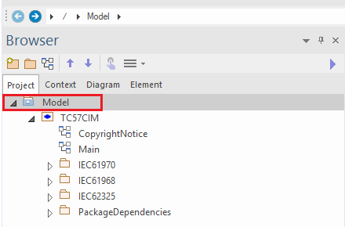
   </p>

* Once selected, choose the Publish menu and then the “Other Formats…” menu.

   <p align="left">
      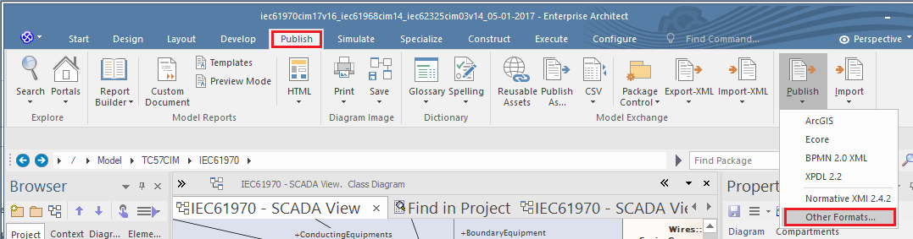
   </p>

* The dialog box shown next will be presented to allow selection of the specific settings to use for export.  Select the **“UML 1.3 (XMI 1.1)”** XML export type.  This is the only export format supported for **cim-compare** comparison reports. It is important that the "Unisys/Rose Format" option **not** be checked. Finally, the inclusion of UML diagrams in the comparison report can optionally be selected at this time. This is done by additionally checking the "Export Diagrams" and "Generate Diagram Images" check boxes along with the selection of an image type (e.g. JPG, GIF, PNG, etc.) to export the diagrams in. Note that when including UML diagrams as part of the export EA will automatically create a directory called "Images" and export all image files into that directory. Note that when exporting an image type other than JPG the `--image-type` command line option described in the [Command Line Usage](#command-line-usage) section must be used.

   <p align="left">
      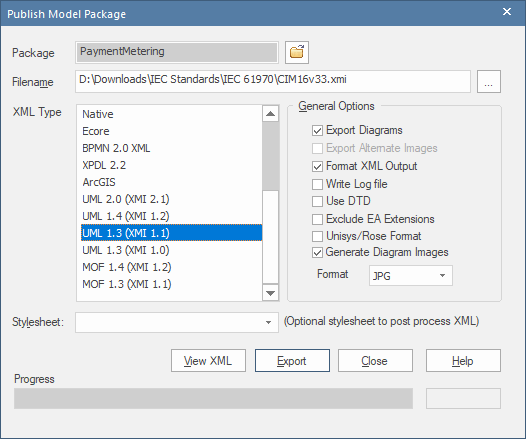
   </p>

* Finish out by selecting a target directory along with a file name for the "Filename" field.  

* Click the **Export** button. Note that at this point it will take a while for the export to complete.

* If UML diagrams were included then upon completion of the export you should navigate to the export directory and rename the diagrams directory from "Images" to "Images-baseline". The naming convention is important and must match what is indicated here including case-sensitivity.

* Now close out of the baseline model load the destination model into EA and perform Steps 1 through 6 again but this time be sure to enter a different name into the "Filename" field for the destination XMI file to be exported. Upon completion the destination model's "Images" directory should be renamed to "Images-destination".

* The result should be a final export directory containing two images directories (i.e. "Images-baseline" and "Images-destination" containing the baseline and destination diagrams respectively) and two distinct XMI files to be used as input on the command line to **cim-compare**.


## License

Distributed under the MIT license. See [LICENSE](LICENSE) for more information.

### Third-Party Software

The `cim-compare-2.0.0.jar` includes the following third-party software:

- **Saxon-HE** 12.5 by Saxonica, used to produce the HTML report, distributed under the [Mozilla Public License 2.0](https://www.mozilla.org/en-US/MPL/2.0/). Source code is available from [github.com/Saxonica/Saxon-HE](https://github.com/Saxonica/Saxon-HE).
- **XML Resolver** 5.2.2, used by Saxon-HE, distributed under the [Apache License 2.0](https://www.apache.org/licenses/LICENSE-2.0).
- **Sparx Systems Enterprise Architect Java API** (`eaapi.jar`), used to export models from EA project files. See [lib/README.md](lib/README.md).
